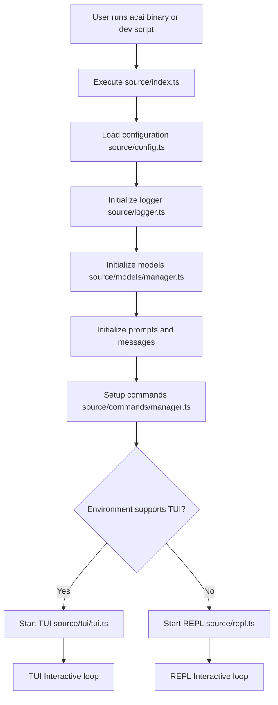
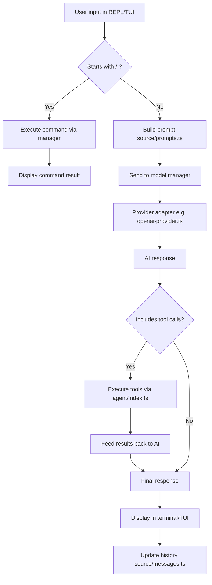
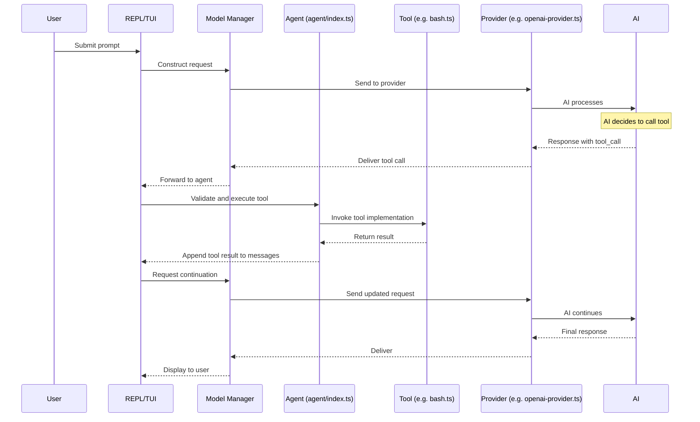
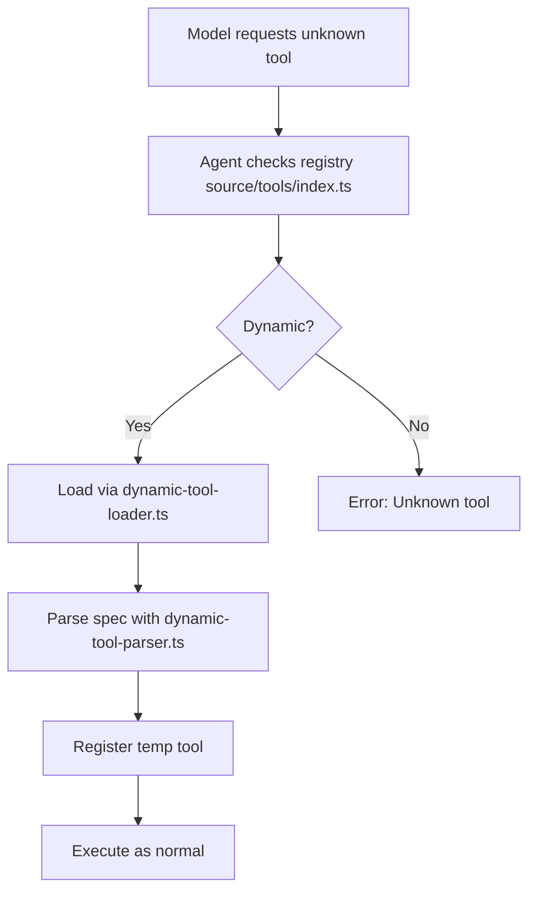
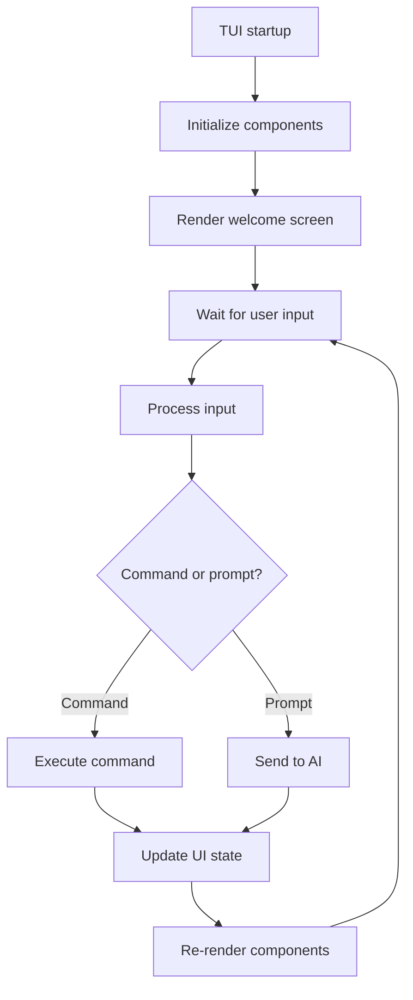

# Acai Architecture

This document outlines the architecture of the Acai CLI tool, an AI-powered command-line assistant for software development. It contains the project structure (excluding dot directories), a comprehensive list of file descriptions, and primary flow diagrams using Mermaid. Updates reflect the current project state as of the latest directory scan.

## Project Structure

```
acai-ts
├── AGENTS.md
├── ARCHITECTURE.md
├── LICENSE
├── README.md
├── TODO.md
├── biome.json
├── commitlint.config.js
├── knip.json
├── package-lock.json
├── package.json
├── tsconfig.build.json
├── tsconfig.json
├── source
│   ├── agent
│   │   ├── index.ts
│   │   └── manual-loop.ts
│   ├── api
│   │   └── exa
│   │       └── index.ts
│   ├── cli.ts
│   ├── commands
│   │   ├── add-directory-command.ts
│   │   ├── application-log-command.ts
│   │   ├── clear-command.ts
│   │   ├── compact-command.ts
│   │   ├── copy-command.ts
│   │   ├── edit-command.ts
│   │   ├── edit-prompt-command.ts
│   │   ├── exit-command.ts
│   │   ├── files-command.ts
│   │   ├── generate-rules-command.ts
│   │   ├── handoff-command.ts
│   │   ├── health-command.ts
│   │   ├── help-command.ts
│   │   ├── history-command.ts
│   │   ├── init-command.ts
│   │   ├── last-log-command.ts
│   │   ├── list-directories-command.ts
│   │   ├── list-tools-command.ts
│   │   ├── manager.ts
│   │   ├── model-command.ts
│   │   ├── paste-command.ts
│   │   ├── pickup-command.ts
│   │   ├── prompt-command.ts
│   │   ├── remove-directory-command.ts
│   │   ├── reset-command.ts
│   │   ├── rules-command.ts
│   │   ├── save-command.ts
│   │   ├── session-command.ts
│   │   ├── shell-command.ts
│   │   ├── types.ts
│   ├── config.ts
│   ├── dedent.ts
│   ├── execution
│   │   └── index.ts
│   ├── formatting.ts
│   ├── index.ts
│   ├── logger.ts
│   ├── mentions.ts
│   ├── messages.ts
│   ├── middleware
│   │   ├── audit-message.ts
│   │   ├── cache.ts
│   │   ├── index.ts
│   │   └── rate-limit.ts
│   ├── models
│   │   ├── ai-config.ts
│   │   ├── anthropic-provider.ts
│   │   ├── deepseek-provider.ts
│   │   ├── google-provider.ts
│   │   ├── groq-provider.ts
│   │   ├── manager.ts
│   │   ├── openai-provider.ts
│   │   ├── openrouter-provider.ts
│   │   ├── providers.ts
│   │   └── xai-provider.ts
│   ├── parsing.ts
│   ├── prompts
│   │   └── manager.ts
│   ├── prompts.ts
│   ├── repl
│   │   ├── display-tool-messages.ts
│   │   ├── display-tool-use.ts
│   │   ├── get-prompt-header.ts
│   │   ├── project-status-line.ts
│   │   ├── prompt.ts
│   │   └── tool-call-repair.ts
│   ├── repl-new.ts
│   ├── repl.ts
│   ├── terminal
│   │   ├── ansi-styles.ts
│   │   ├── checkbox-prompt.ts
│   │   ├── default-theme.ts
│   │   ├── east-asian-width.ts
│   │   ├── editor-prompt.ts
│   │   ├── errors.ts
│   │   ├── formatting.ts
│   │   ├── highlight
│   │   │   ├── index.ts
│   │   │   └── theme.ts
│   │   ├── index.ts
│   │   ├── input-prompt.ts
│   │   ├── markdown-utils.ts
│   │   ├── markdown.ts
│   │   ├── search-prompt.ts
│   │   ├── select-prompt.ts
│   │   ├── string-width.ts
│   │   ├── strip-ansi.ts
│   │   ├── style.ts
│   │   ├── supports-color.ts
│   │   ├── supports-hyperlinks.ts
│   │   ├── types.ts
│   │   └── wrap-ansi.ts
│   ├── terminal-output.test.ts
│   ├── tokens
│   │   ├── counter.ts
│   │   ├── threshold.ts
│   │   └── tracker.ts
│   ├── tools
│   │   ├── advanced-edit-file.ts
│   │   ├── agent.ts
│   │   ├── bash.ts
│   │   ├── code-interpreter.ts
│   │   ├── delete-file.ts
│   │   ├── directory-tree.ts
│   │   ├── dynamic-tool-loader.ts
│   │   ├── dynamic-tool-parser.ts
│   │   ├── edit-file.ts
│   │   ├── git.ts
│   │   ├── glob.ts
│   │   ├── grep.ts
│   │   ├── index.ts
│   │   ├── llm-edit-fixer.ts
│   │   ├── move-file.ts
│   │   ├── read-file.ts
│   │   ├── read-multiple-files.ts
│   │   ├── save-file.ts
│   │   ├── think.ts
│   │   ├── types.ts
│   │   ├── utils.ts
│   │   ├── web-fetch.ts
│   │   └── web-search.ts
│   ├── tui
│   │   ├── autocomplete.ts
│   │   ├── components
│   │   │   ├── assistant-message.ts
│   │   │   ├── editor.ts
│   │   │   ├── footer.ts
│   │   │   ├── input.ts
│   │   │   ├── loader.ts
│   │   │   ├── markdown.ts
│   │   │   ├── modal.ts
│   │   │   ├── prompt-status.ts
│   │   │   ├── select-list.ts
│   │   │   ├── spacer.ts
│   │   │   ├── text.ts
│   │   │   ├── thinking-block.ts
│   │   │   ├── tool-execution.ts
│   │   │   ├── user-message.ts
│   │   │   └── welcome.ts
│   │   ├── index.ts
│   │   ├── terminal.ts
│   │   ├── tui-output.test.ts
│   │   ├── tui.ts
│   │   └── utils.ts
│   ├── utils
│   │   ├── filesystem.ts
│   │   ├── filetype-detection.ts
│   │   ├── bash.ts
│   │   ├── filesystem/
│   │   │   ├── operations.ts
│   │   │   └── security.ts
│   │   ├── funcs.ts
│   │   ├── generators.ts
│   │   ├── git.ts
│   │   ├── glob.ts
│   │   ├── ignore.ts
│   │   ├── iterables.ts
│   │   ├── process.ts
│   │   └── zod.ts
│   └── version.ts
├── test
│   ├── advanced-edit-file.test.ts
│   ├── agent
│   ├── commands
│   │   ├── context-command.test.ts
│   │   ├── copy-command.test.ts
│   │   ├── exit-command.test.ts
│   │   ├── health-command.test.ts
│   │   ├── history-command.integration.test.ts
│   │   ├── history-command.test.ts
│   │   ├── prompt-history.test.ts
│   │   └── shell-command.test.ts
│   ├── config.test.ts
│   ├── execution.test.ts
│   ├── mentions.test.ts
│   ├── terminal
│   │   ├── checkbox-prompt.test.ts
│   │   ├── editor-prompt.test.ts
│   │   ├── highlight.test.ts
│   │   ├── markdown-utils.test.ts
│   │   ├── markdown.test.ts
│   │   ├── search-prompt.test.ts
│   ├── tokens
│   │   └── threshold.test.ts
│   ├── tools
│   │   ├── bash.test.ts
│   │   ├── code-interpreter.test.ts
│   │   ├── dynamic-tool-integration.test.ts
│   │   ├── dynamic-tool-parser.test.ts
│   │   ├── edit-file.test.ts
│   │   ├── glob.test.ts
│   │   ├── grep-enhanced-ux.test.ts
│   │   ├── grep-error-handling.test.ts
│   │   ├── grep-issue-96.test.ts
│   │   ├── grep-match-counting.test.ts
│   │   ├── grep-max-results.test.ts
│   │   ├── grep.test.ts
│   │   └── llm-edit-fixer.test.ts
│   ├── tui
│   │   ├── autocomplete.test.ts
│   │   ├── components
│   │   │   └── modal-table.test.ts
│   │   └── modal.test.ts
│   ├── utils
│   │   ├── bash.test.ts
│   │   ├── filesystem/
│   │   │   └── security.test.ts
│   │   ├── filesystem.test.ts
│   │   ├── generators.test.ts
│   │   ├── glob.test.ts
│   │   ├── ignore.test.ts
│   │   ├── mocking.ts
│   │   └── process.test.ts
```

Notes:
- Dot directories (e.g., .acai, .github, .husky) are omitted.
- Empty directories like saved-selections are included but have no files.

## File Descriptions

Files are grouped by directory. Descriptions are brief overviews of purpose and responsibilities based on code structure and naming conventions.

### Top-level Files
- **AGENTS.md**: Documentation of agent behaviors, rules, and prompts used by the AI.
- **ARCHITECTURE.md**: This document, detailing project structure, files, and flows.
- **LICENSE**: MIT license for the project.
- **README.md**: Introduction, installation, and usage instructions.
- **TODO.md**: List of planned features and tasks.
- **biome.json**: Configuration for Biome (linting and formatting tool).
- **commitlint.config.js**: Configuration for commit message validation.
- **knip.json**: Configuration for Knip (unused code detector).
- **package-lock.json**: Locked dependencies for reproducible installs.
- **package.json**: Project metadata, dependencies, scripts, and binary entry points (acai -> dist/index.js).
- **tsconfig.build.json**: TypeScript configuration for production build.
- **tsconfig.json**: TypeScript configuration for development and type-checking.

### source/ Directory
- **agent/index.ts**: Main agent loop implementation for AI interactions and tool execution.
- **agent/manual-loop.ts**: Manual loop implementation for agent operations.
- **api/exa/index.ts**: Integration for Exa API, likely for advanced search or data retrieval tools.
- **cli.ts**: Parses command-line arguments and flags for the application.
- **commands/add-directory-command.ts**: Command to add additional working directories.
- **commands/application-log-command.ts**: Command to view or manage application logs.
- **commands/clear-command.ts**: Command to clear the conversation history or screen.
- **commands/compact-command.ts**: Command to compact or summarize conversation history.
- **commands/copy-command.ts**: Command to copy output or selections to clipboard.
- **commands/edit-command.ts**: Command to edit files or prompts using AI.
- **commands/edit-prompt-command.ts**: Command to edit saved prompts.
- **commands/exit-command.ts**: Command to exit the REPL.
- **commands/files-command.ts**: Command to list or manage project files.
- **commands/generate-rules-command.ts**: Command to generate or update agent rules.
- **commands/handoff-command.ts**: Command to hand off conversation to another agent.
- **commands/health-command.ts**: Command to check application health and status.
- **commands/help-command.ts**: Command to display help information.
- **commands/history-command.ts**: Command to view and manage conversation history.
- **commands/init-command.ts**: Command to initialize the project or configuration.
- **commands/last-log-command.ts**: Command to show the last log entry.
- **commands/list-directories-command.ts**: Command to list all working directories.
- **commands/list-tools-command.ts**: Command to list available tools.
- **commands/manager.ts**: Manages registration and execution of all commands.
- **commands/model-command.ts**: Command to switch or configure AI models.
- **commands/paste-command.ts**: Command to paste input from clipboard.
- **commands/pickup-command.ts**: Command to resume a previous conversation.
- **commands/prompt-command.ts**: Command to manage or execute saved prompts.
- **commands/remove-directory-command.ts**: Command to remove a working directory.
- **commands/reset-command.ts**: Command to reset conversation or state.
- **commands/rules-command.ts**: Command to view or edit rules.
- **commands/save-command.ts**: Command to save conversation or outputs.
- **commands/session-command.ts**: Command to show comprehensive session information including usage, context, and costs.
- **commands/shell-command.ts**: Command to execute shell commands interactively.
- **commands/types.ts**: Type definitions for commands.
- **config.ts**: Loads and validates configuration from env, files, and defaults.
- **dedent.ts**: Utility function to remove indentation from multi-line strings.
- **execution/index.ts**: Handles execution of code or commands, possibly wrapping tools.
- **formatting.ts**: Utilities for formatting text, code, or output.
- **index.ts**: Main entry point; bootstraps app, initializes subsystems, and starts REPL.
- **logger.ts**: Configures and provides logging throughout the application.
- **mentions.ts**: Detects and handles @mentions in prompts or messages.
- **messages.ts**: Manages message history, persistence, and serialization.
- **middleware/audit-message.ts**: Middleware to audit and log messages for compliance.
- **middleware/cache.ts**: Middleware to cache responses for performance.
- **middleware/index.ts**: Exports middleware chain for request/response processing.
- **middleware/rate-limit.ts**: Middleware to enforce rate limiting on API calls.
- **models/ai-config.ts**: Configuration and capability detection for AI models.
- **models/anthropic-provider.ts**: Adapter for Anthropic AI provider.
- **models/deepseek-provider.ts**: Adapter for DeepSeek AI provider.
- **models/google-provider.ts**: Adapter for Google AI provider.
- **models/groq-provider.ts**: Adapter for Groq AI provider.
- **models/manager.ts**: Manages selection and invocation of AI providers and models.
- **models/openai-provider.ts**: Adapter for OpenAI provider.
- **models/openrouter-provider.ts**: Adapter for OpenRouter provider.
- **models/providers.ts**: Base types and utilities for all providers.
- **models/xai-provider.ts**: Adapter for xAI provider.
- **parsing.ts**: Utilities for parsing user input, responses, or data.
- **prompts/manager.ts**: Manages loading and saving of prompt templates.
- **prompts.ts**: Builds system and user prompts for AI interactions.
- **repl/display-tool-messages.ts**: Displays messages related to tool executions in REPL.
- **repl/display-tool-use.ts**: Handles display of tool usage in the REPL.
- **repl/get-prompt-header.ts**: Generates headers for REPL prompts.
- **repl/project-status-line.ts**: Displays project status information in REPL.
- **repl/prompt.ts**: Configures the interactive prompt for the REPL.
- **repl/tool-call-repair.ts**: Repairs or handles errors in tool calls.
- **repl-new.ts**: New REPL implementation with enhanced features.
- **repl.ts**: Implements the Read-Eval-Print Loop for interactive sessions.
- **terminal/ansi-styles.ts**: ANSI color and style utilities for terminal output.
- **terminal/checkbox-prompt.ts**: Interactive prompt for checkbox selections.
- **terminal/default-theme.ts**: Default color theme for terminal output.
- **terminal/east-asian-width.ts**: Utilities for handling East Asian character widths.
- **terminal/editor-prompt.ts**: Prompt for editing text in terminal.
- **terminal/errors.ts**: Error handling for terminal operations.
- **terminal/formatting.ts**: Formatting functions for terminal display.
- **terminal/highlight/index.ts**: Syntax highlighting implementation.
- **terminal/highlight/theme.ts**: Themes for syntax highlighting.
- **terminal/index.ts**: Main terminal utilities module.
- **terminal/input-prompt.ts**: Generic input prompt for terminal.
- **terminal/markdown-utils.ts**: Utilities for rendering Markdown in terminal.
- **terminal/markdown.ts**: Markdown parser and renderer for terminal.
- **terminal/search-prompt.ts**: Prompt for searching within terminal.
- **terminal/select-prompt.ts**: Prompt for single selections.
- **terminal/string-width.ts**: Calculates display width of strings.
- **terminal/strip-ansi.ts**: Strips ANSI escape codes from strings.
- **terminal/style.ts**: Styling utilities for terminal text.
- **terminal/supports-color.ts**: Detects terminal color support.
- **terminal/supports-hyperlinks.ts**: Detects hyperlink support in terminal.
- **terminal/types.ts**: Type definitions for terminal components.
- **terminal/wrap-ansi.ts**: Wraps text with ANSI escape codes.
- **terminal-output.test.ts**: Unit tests for terminal output rendering.
- **tokens/counter.ts**: Utilities for counting tokens in text.
- **tokens/threshold.ts**: Manages token usage thresholds and limits.
- **tokens/tracker.ts**: Tracks token usage across sessions.
- **tools/advanced-edit-file.ts**: Advanced file editing tool with multiple modes.
- **tools/agent.ts**: AI agent logic for coordinating tool usage.
- **tools/bash.ts**: Tool for executing shell commands safely.
- **tools/code-interpreter.ts**: Tool for running JavaScript code in a sandbox.
- **tools/delete-file.ts**: Tool to delete files with validation.
- **tools/directory-tree.ts**: Tool to generate project directory tree.
- **tools/dynamic-tool-loader.ts**: Dynamically loads tool definitions.
- **tools/dynamic-tool-parser.ts**: Parses dynamic tool specifications.
- **tools/edit-file.ts**: Tool to edit files with diff support.
- **tools/git.ts**: Utilities for Git operations.
- **tools/glob.ts**: Tool for glob-based file searching.
- **tools/grep.ts**: Tool for searching files using ripgrep.
- **tools/index.ts**: Registry and exports for all tools.
- **tools/llm-edit-fixer.ts**: Tool for fixing LLM-generated edits.
- **tools/move-file.ts**: Tool to move or rename files.
- **tools/read-file.ts**: Tool to read file contents.
- **tools/read-multiple-files.ts**: Tool to read multiple files at once.
- **tools/save-file.ts**: Tool to save or create files.
- **tools/think.ts**: Tool for agent to log thoughts without side effects.
- **tools/types.ts**: Type definitions for tools.
- **tools/utils.ts**: Utility functions for tools.
- **tools/web-fetch.ts**: Tool to fetch web content.
- **tools/web-search.ts**: Tool for web searching.
- **tui/autocomplete.ts**: Autocomplete functionality for TUI.
- **tui/components/assistant-message.ts**: Component for displaying AI assistant messages.
- **tui/components/editor.ts**: Text editor component for TUI.
- **tui/components/footer.ts**: Footer component for TUI.
- **tui/components/input.ts**: Input component for TUI.
- **tui/components/loader.ts**: Loading indicator component.
- **tui/components/markdown.ts**: Markdown rendering component.
- **tui/components/modal.ts**: Modal dialog component.
- **tui/components/prompt-status.ts**: Status display for prompts.
- **tui/components/select-list.ts**: Selectable list component.
- **tui/components/spacer.ts**: Spacer component for layout.
- **tui/components/text.ts**: Text display component.
- **tui/components/thinking-block.ts**: Component for displaying AI thinking state.
- **tui/components/tool-execution.ts**: Component for displaying tool execution.
- **tui/components/user-message.ts**: Component for displaying user messages.
- **tui/components/welcome.ts**: Welcome screen component.
- **tui/index.ts**: Main exports for TUI components and interfaces.
- **tui/terminal.ts**: Terminal interface implementation for TUI.
- **tui/tui-output.test.ts**: Unit tests for TUI output rendering.
- **tui/tui.ts**: Main TUI (Terminal User Interface) implementation.
- **tui/utils.ts**: Utility functions for TUI.
- **utils/filesystem.ts**: Filesystem-related utilities.
- **utils/filetype-detection.ts**: Detects file types based on content or extension.
- **utils/generators.ts**: Utilities for generating unique IDs or names.
- **utils/bash.ts**: Utilities for bash command execution.
- **utils/filesystem/operations.ts**: Filesystem operations utilities.
- **utils/filesystem/security.ts**: Filesystem security and path validation utilities.
- **utils/funcs.ts**: General utility functions.
- **utils/git.ts**: Utilities for Git operations.
- **utils/glob.ts**: Glob pattern matching utilities.
- **utils/ignore.ts**: Handles ignore patterns for files.
- **utils/iterables.ts**: Utilities for working with iterables.
- **utils/process.ts**: Utilities for spawning and managing processes.
- **utils/zod.ts**: Zod schema utilities for validation.
- **version.ts**: Manages and exposes application version.

### test/ Directory
- **advanced-edit-file.test.ts**: Unit tests for advanced edit file tool.
- **agent/**: Directory for agent-related tests (empty currently).
- **commands/context-command.test.ts**: Unit tests for context command (deprecated).
- **commands/copy-command.test.ts**: Unit tests for copy command.
- **commands/exit-command.test.ts**: Unit tests for exit command.
- **commands/health-command.test.ts**: Unit tests for health command.
- **commands/history-command.integration.test.ts**: Integration tests for history command.
- **commands/history-command.test.ts**: Unit tests for history command.
- **commands/prompt-history.test.ts**: Unit tests for prompt history.
- **commands/session-command.test.ts**: Unit tests for session command.
- **commands/shell-command.test.ts**: Unit tests for shell command.
- **config.test.ts**: Unit tests for configuration loading.
- **execution.test.ts**: Unit tests for execution module.
- **mentions.test.ts**: Unit tests for mention detection.
- **terminal/checkbox-prompt.test.ts**: Unit tests for checkbox prompt.
- **terminal/editor-prompt.test.ts**: Unit tests for editor prompt.
- **terminal/highlight.test.ts**: Unit tests for syntax highlighting.
- **terminal/markdown-utils.test.ts**: Unit tests for Markdown utilities.
- **terminal/markdown.test.ts**: Unit tests for Markdown rendering.
- **terminal/search-prompt.test.ts**: Unit tests for search prompt.
- **tokens/threshold.test.ts**: Unit tests for token threshold management.
- **tools/bash.test.ts**: Unit tests for bash tool.
- **tools/code-interpreter.test.ts**: Unit tests for code interpreter tool.
- **tools/dynamic-tool-integration.test.ts**: Integration tests for dynamic tools.
- **tools/dynamic-tool-parser.test.ts**: Unit tests for dynamic tool parser.
- **tools/edit-file.test.ts**: Unit tests for edit file tool.
- **tools/glob.test.ts**: Unit tests for glob tool.
- **tools/grep-enhanced-ux.test.ts**: Unit tests for grep enhanced UX.
- **tools/grep-error-handling.test.ts**: Unit tests for grep error handling.
- **tools/grep-issue-96.test.ts**: Unit tests for specific grep issue.
- **tools/grep-match-counting.test.ts**: Unit tests for grep match counting.
- **tools/grep-max-results.test.ts**: Unit tests for grep max results.
- **tools/grep.test.ts**: Unit tests for grep tool.
- **tools/llm-edit-fixer.test.ts**: Unit tests for LLM edit fixer.
- **tui/autocomplete.test.ts**: Unit tests for TUI autocomplete.
- **tui/components/modal-table.test.ts**: Unit tests for modal table component.
- **tui/modal.test.ts**: Unit tests for modal component.
- **utils/filesystem.test.ts**: Unit tests for filesystem utilities.
- **utils/bash.test.ts**: Unit tests for bash utilities.
- **utils/filesystem/security.test.ts**: Unit tests for filesystem security utilities.
- **utils/filesystem.test.ts**: Unit tests for filesystem operations utilities.
- **utils/generators.test.ts**: Unit tests for generators.
- **utils/glob.test.ts**: Unit tests for glob utilities.
- **utils/ignore.test.ts**: Unit tests for ignore utilities.
- **utils/mocking.ts**: Mocking utilities for tests.
- **utils/process.test.ts**: Unit tests for process utilities.

## Flow Diagram

Entry points from package.json:
- Binary: `acai` -> `dist/index.js` (built from source/index.ts)
- Development: `npm run dev` -> `node ./source/index.ts`

### Application Startup and Interface Selection



### User Input Handling (Command vs AI Prompt)



### Tool Execution Flow



### Dynamic Tool Loading



### TUI Component Rendering Flow



These diagrams cover the primary flows: startup, interface selection, input processing, tool invocation, dynamic tool support, and TUI component rendering.