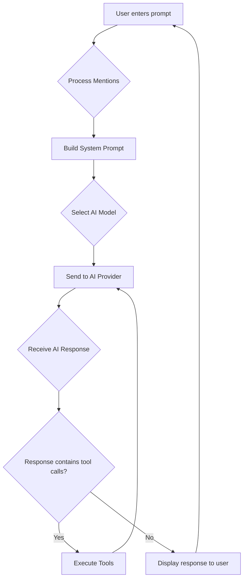
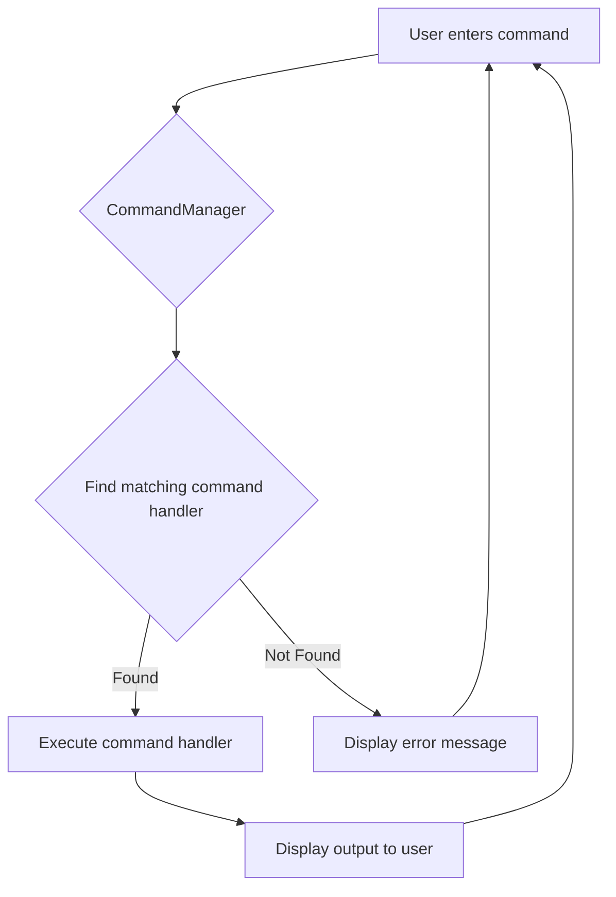

# Acai Architecture

This document outlines the architecture of the Acai CLI tool, a powerful AI-driven software development assistant. It details the project structure, provides descriptions for each file, and illustrates the primary application flows with Mermaid diagrams.

## Project Structure

```
├── acai-ts
│   ├── .acai
│   │   ├── acai.json
│   │   ├── memory
│   │   ├── prompts
│   │   │   ├── add-openrouter-model.md
│   │   │   ├── project-status.md
│   │   │   └── update-architecture-document.md
│   │   ├── rules
│   │   │   └── learned-rules.md
│   ├── .github
│   │   ├── ISSUES
│   ├── .gitignore
│   ├── .husky
│   │   ├── _
│   │   │   ├── .gitignore
│   │   │   ├── applypatch-msg
│   │   │   ├── commit-msg
│   │   │   ├── h
│   │   │   ├── husky.sh
│   │   │   ├── post-applypatch
│   │   │   ├── post-checkout
│   │   │   ├── post-commit
│   │   │   ├── post-merge
│   │   │   ├── post-rewrite
│   │   │   ├── pre-applypatch
│   │   │   ├── pre-auto-gc
│   │   │   ├── pre-commit
│   │   │   ├── pre-merge-commit
│   │   │   ├── pre-push
│   │   │   ├── pre-rebase
│   │   │   └── prepare-commit-msg
│   │   ├── commit-msg
│   │   ├── pre-commit
│   │   └── pre-push
│   ├── .ignore
│   ├── .npmignore
│   ├── .tmp
│   ├── AGENTS.md
│   ├── ARCHITECTURE.md
│   ├── LICENSE
│   ├── README.md
│   ├── TODO.md
│   ├── biome.json
│   ├── commitlint.config.js
│   ├── knip.json
│   ├── package-lock.json
│   ├── package.json
│   ├── source
│   │   ├── cli.ts
│   │   ├── commands
│   │   │   ├── application-log-command.ts
│   │   │   ├── clear-command.ts
│   │   │   ├── compact-command.ts
│   │   │   ├── copy-command.ts
│   │   │   ├── edit-command.ts
│   │   │   ├── edit-prompt-command.ts
│   │   │   ├── exit-command.ts
│   │   │   ├── files-command.ts
│   │   │   ├── generate-rules-command.ts
│   │   │   ├── health-command.ts
│   │   │   ├── help-command.ts
│   │   │   ├── init-command.ts
│   │   │   ├── last-log-command.ts
│   │   │   ├── manager.ts
│   │   │   ├── model-command.ts
│   │   │   ├── paste-command.ts
│   │   │   ├── prompt-command.ts
│   │   │   ├── reset-command.ts
│   │   │   ├── rules-command.ts
│   │   │   ├── save-command.ts
│   │   │   ├── types.ts
│   │   │   ├── usage-command.ts
│   │   ├── config.ts
│   │   ├── conversation-analyzer.ts
│   │   ├── dedent.ts
│   │   ├── formatting.ts
│   │   ├── index.ts
│   │   ├── logger.ts
│   │   ├── mentions.ts
│   │   ├── messages.ts
│   │   ├── middleware
│   │   │   ├── audit-message.ts
│   │   │   ├── index.ts
│   │   │   ├── rate-limit.ts
│   │   ├── models
│   │   │   ├── ai-config.ts
│   │   │   ├── anthropic-provider.ts
│   │   │   ├── deepseek-provider.ts
│   │   │   ├── google-provider.ts
│   │   │   ├── manager.ts
│   │   │   ├── openai-provider.ts
│   │   │   ├── openrouter-provider.ts
│   │   │   ├── providers.ts
│   │   │   ├── xai-provider.ts
│   │   ├── parsing.ts
│   │   ├── prompts
│   │   │   └── manager.ts
│   │   ├── prompts.ts
│   │   ├── repl-prompt.ts
│   │   ├── repl.ts
│   │   ├── saved-selections
│   │   ├── terminal
│   │   │   ├── formatting.ts
│   │   │   ├── index.ts
│   │   │   ├── markdown-utils.ts
│   │   │   ├── markdown.ts
│   │   │   ├── supports-color.ts
│   │   │   ├── supports-hyperlinks.ts
│   │   │   └── types.ts
│   │   ├── terminal-output.test.ts
│   │   ├── token-tracker.ts
│   │   ├── token-utils.ts
│   │   ├── tools
│   │   │   ├── agent.ts
│   │   │   ├── bash.ts
│   │   │   ├── code-interpreter.ts
│   │   │   ├── command-validation.ts
│   │   │   ├── delete-file.ts
│   │   │   ├── directory-tree.ts
│   │   │   ├── edit-file.ts
│   │   │   ├── filesystem-utils.ts
│   │   │   ├── git-utils.ts
│   │   │   ├── grep.ts
│   │   │   ├── index.ts
│   │   │   ├── move-file.ts
│   │   │   ├── read-file.ts
│   │   │   ├── read-multiple-files.ts
│   │   │   ├── save-file.ts
│   │   │   ├── think.ts
│   │   │   ├── types.ts
│   │   │   ├── web-fetch.ts
│   │   │   ├── web-search.ts
│   │   ├── utils
│   │   │   └── process.ts
│   │   ├── version.ts
│   ├── test
│   │   ├── commands
│   │   │   ├── copy-command.test.ts
│   │   │   └── health-command.test.ts
│   │   ├── config.test.ts
│   │   ├── terminal
│   │   │   └── markdown-utils.test.ts
│   │   ├── tools
│   │   │   ├── bash-tool.test.ts
│   │   │   ├── code-interpreter.test.ts
│   │   │   ├── command-validation.test.ts
│   │   │   └── grep.test.ts
│   ├── tsconfig.build.json
│   ├── tsconfig.json
```

## File Descriptions

| File Path | Description |
| :--- | :--- |
| **.acai** | This directory serves as the central location for Acai's internal state, configuration, and temporary files. |
| **acai.json** | This file contains project-specific configuration for the Acai CLI tool, including custom commands and tool settings. |
| **.acai/memory** | Directory for storing the AI's short-term and long-term memory. |
| **.acai/prompts** | Directory for storing custom and learned prompts for the AI. |
| **add-openrouter-model.md** | A prompt related to adding an OpenRouter model. |
| **project-status.md** | A prompt related to the current project status. |
| **update-architecture-document.md** | A prompt used for updating the architecture document. |
| **.acai/rules** | Directory for storing learned rules for the AI. |
| **learned-rules.md** | This file stores rules learned by Acai based on user corrections and feedback, aiming to improve its future behavior. |
| **.github** | Directory for GitHub specific configurations, such as issue templates. |
| **.github/ISSUES** | Likely a template or configuration file for GitHub Issues. |
| **.gitignore** | This file specifies intentionally untracked files and directories that Git should ignore during version control. |
| **.husky** | Directory for Husky Git hooks configuration. |
| **.husky/_** | Internal Husky directory containing hook scripts. |
| **.husky/_/.gitignore** | Git ignore for Husky internal files. |
| **.husky/_/applypatch-msg** | Git hook script for applypatch-msg. |
| **.husky/_/commit-msg** | Git hook script for commit-msg. |
| **.husky/_/h** | Likely an internal Husky helper script. |
| **.husky/_/husky.sh** | Main Husky shell script. |
| **.husky/_/post-applypatch** | Git hook script for post-applypatch. |
| **.husky/_/post-checkout** | Git hook script for post-checkout. |
| **.husky/_/post-commit** | Git hook script for post-commit. |
| **.husky/_/post-merge** | Git hook script for post-merge. |
| **.husky/_/post-rewrite** | Git hook script for post-rewrite. |
| **.husky/_/pre-applypatch** | Git hook script for pre-applypatch. |
| **.husky/_/pre-auto-gc** | Git hook script for pre-auto-gc. |
| **.husky/_/pre-commit** | Git hook script for pre-commit. |
| **.husky/_/pre-merge-commit** | Git hook script for pre-merge-commit. |
| **.husky/_/pre-push** | Git hook script for pre-push. |
| **.husky/_/pre-rebase** | Git hook script for pre-rebase. |
| **.husky/_/prepare-commit-msg** | Git hook script for prepare-commit-msg. |
| **.husky/commit-msg** | Husky configuration for commit-msg hook. |
| **.husky/pre-commit** | Husky configuration for pre-commit hook. |
| **.husky/pre-push** | Husky configuration for pre-push hook. |
| **.ignore** | This file is used by file watching or search tools (like ripgrep) to specify files and directories to ignore beyond `.gitignore`. |
| **.npmignore** | Specifies files to be ignored when publishing an npm package. |
| **.tmp** | Temporary directory for transient files. |
| **AGENTS.md** | This markdown file contains project-specific rules, guidelines, and commands for Acai to follow. |
| **ARCHITECTURE.md** | This document outlines the overall architecture and project structure of the Acai CLI tool. |
| **LICENSE** | Contains the licensing information for the project. |
| **README.md** | This file provides a comprehensive overview of the Acai project, including its features, installation instructions, usage examples, and configuration details. |
| **TODO.md** | This markdown file lists tasks or features that are planned for future implementation within the project. |
| **biome.json** | This file is the configuration for the Biome tool, defining code formatting and linting rules for the project. |
| **commitlint.config.js** | Configuration file for commitlint to enforce Conventional Commits. |
| **knip.json** | This file is the configuration for Knip, a tool used to detect unused files, dependencies, and exports in the project. |
| **package-lock.json** | This file records the exact versions of all installed Node.js dependencies, ensuring reproducible builds across different environments. |
| **package.json** | This file defines project metadata (name, version), dependencies, development scripts, and binary entry points for the Node.js project. |
| **source** | Main directory for the application's source code. |
| **source/cli.ts** | Command-line interface entry point and argument parsing. |
| **source/commands/** | Directory containing all REPL command implementations. |
| **application-log-command.ts** | Command for viewing application logs. |
| **clear-command.ts** | Implements the `/clear` REPL command to clear the terminal screen. |
| **compact-command.ts** | Implements the `/compact` REPL command to save, summarize, and reset chat history. |
| **copy-command.ts** | Implements `/copy` to copy the last assistant response to the system clipboard. |
| **edit-command.ts** | Command for editing files directly within the REPL. |
| **edit-prompt-command.ts** | Command to modify the current prompt before sending to AI. |
| **exit-command.ts** | Implements the `/exit` command to exit the application. |
| **files-command.ts** | Command to interactively select files and add their content to the prompt. |
| **generate-rules-command.ts** | Command to generate new rules based on conversation analysis. |
| **health-command.ts** | Command to check the health and status of the application. |
| **help-command.ts** | Implements the `/help` command to display usage information. |
| **init-command.ts** | Command to initialize or improve the AGENTS.md file. |
| **last-log-command.ts** | Command to view the most recent application log entries. |
| **manager.ts** | Defines the CommandManager class that registers and routes commands. |
| **model-command.ts** | Command to list available AI models or switch between them. |
| **paste-command.ts** | Implements the `/paste` command to add clipboard contents to the next prompt. |
| **prompt-command.ts** | Command to load previously saved prompts. |
| **reset-command.ts** | Implements the `/reset` command to save and reset chat history. |
| **rules-command.ts** | Command to view/edit persistent project rules and memories. |
| **save-command.ts** | Implements the `/save` command to save current chat history. |
| **types.ts** | Common TypeScript types and interfaces for commands. |
| **usage-command.ts** | Command to display token usage breakdown. |
| **source/config.ts** | Manages configuration files from project and user directories. |
| **source/conversation-analyzer.ts** | Analyzes conversation history to identify user corrections and infer new rules. |
| **source/dedent.ts** | Utility for removing common indentation from multi-line strings. |
| **source/formatting.ts** | Utilities for formatting content consistently in prompts/output. |
| **source/index.ts** | Main entry point for the acai CLI application. |
| **source/logger.ts** | Configures application-wide logging with pino and file transport. |
| **source/mentions.ts** | Handles @mentions in prompts to auto-fetch file/URL content. |
| **source/messages.ts** | Manages conversation log, saving/loading history, and summarization. |
| **source/middleware/** | Directory for middleware components. |
| **audit-message.ts** | Middleware to log AI requests/responses for debugging. |
| **index.ts** | Barrel file exporting middleware components. |
| **rate-limit.ts** | Middleware to enforce rate limits on AI API calls. |
| **source/models/** | Directory for AI model management. |
| **ai-config.ts** | Determines dynamic AI parameters based on model capabilities. |
| **anthropic-provider.ts** | Configuration for Anthropic AI provider. |
| **deepseek-provider.ts** | Configuration for DeepSeek AI provider. |
| **google-provider.ts** | Configuration for Google AI provider. |
| **manager.ts** | ModelManager class for managing AI model registry. |
| **openai-provider.ts** | Configuration for OpenAI provider. |
| **openrouter-provider.ts** | Configuration for OpenRouter AI provider. |
| **providers.ts** | Central registry of supported AI models and helpers. |
| **xai-provider.ts** | Configuration for XAI provider. |
| **source/parsing.ts** | Utilities for data parsing, especially JSON with Zod. |
| **source/prompts/** | Directory for prompt management. |
| **manager.ts** | PromptManager class for managing prompt state. |
| **source/prompts.ts** | Dynamically generates the main system prompt for AI models. |
| **source/repl-prompt.ts** | Implements user input prompt with history and tab completion. |
| **source/repl.ts** | Repl class that orchestrates the main application loop. |
| **source/saved-selections** | Directory for storing saved file selections. |
| **source/terminal/** | Terminal output and formatting utilities. |
| **formatting.ts** | Low-level terminal manipulation functions. |
| **index.ts** | Main Terminal class for formatted console output. |
| **markdown-utils.ts** | Utilities for processing Markdown content. |
| **markdown.ts** | Core logic for Markdown processing. |
| **supports-color.ts** | Utility to detect if the terminal supports color output. |
| **supports-hyperlinks.ts** | Utility to detect if the terminal supports hyperlinks. |
| **types.ts** | Type definitions for terminal module. |
| **terminal-output.test.ts** | Tests for terminal output functionalities. |
| **source/token-tracker.ts** | Tracks and aggregates token usage across AI calls. |
| **source/token-utils.ts** | Utilities for accurate token counting using tiktoken. |
| **source/tools/** | Directory containing all tool implementations. |
| **agent.ts** | Core AI agent logic. |
| **bash.ts** | Executes whitelisted shell commands securely. |
| **code-interpreter.ts** | Executes sandboxed JavaScript code. |
| **command-validation.ts** | Validates CLI commands. |
| **delete-file.ts** | Removes files from the file system. |
| **directory-tree.ts** | Gets directory tree structure. |
| **edit-file.ts** | Modifies file contents with path validation. |
| **filesystem-utils.ts** | General utilities for file system operations. |
| **git-utils.ts** | Utilities for Git operations. |
| **grep.ts** | Searches file contents using ripgrep. |
| **index.ts** | Initializes and exports all tools. |
| **move-file.ts** | Moves or renames files. |
| **read-file.ts** | Reads file contents. |
| **read-multiple-files.ts** | Reads multiple files efficiently. |
| **save-file.ts** | Writes content to files. |
| **think.ts** | Tool to log AI thought process. |
| **types.ts** | Common types for tool communication. |
| **web-fetch.ts** | Retrieves content from URLs. |
| **web-search.ts** | Performs web searches using Exa API. |
| **source/utils** | Utilities for various purposes. |
| **source/utils/process.ts** | Robust promise-based wrapper for child_process.execFile. |
| **source/version.ts** | Manages and exports the application's version. |
| **test** | Directory containing test files for the application. |
| **test/commands** | Tests for command implementations. |
| **test/commands/copy-command.test.ts** | Tests for the copy command. |
| **test/commands/health-command.test.ts** | Tests for the health command. |
| **test/config.test.ts** | Tests for configuration management. |
| **test/terminal** | Tests for terminal utilities. |
| **test/terminal/markdown-utils.test.ts** | Tests for markdown utilities. |
| **test/tools** | Tests for tools implementations. |
| **test/tools/bash-tool.test.ts** | Tests for the bash tool. |
| **test/tools/code-interpreter.test.ts** | Tests for the code interpreter tool. |
| **test/tools/command-validation.test.ts** | Tests for command validation. |
| **test/tools/grep.test.ts** | Tests for the grep tool. |
| **tsconfig.build.json** | TypeScript configuration specifically for building the project. |
| **tsconfig.json** | TypeScript compiler configuration. |

## Flow Diagram

The primary entry point for the Acai CLI is `source/index.ts`, which is compiled to `dist/index.js` and executed via the `acai` binary defined in `package.json`. The application initializes and enters a REPL (Read-Eval-Print Loop) to handle user input.

### Application Initialization and REPL

```mermaid
graph TD
    A[Start acai] --> B{source/index.ts};
    B --> C[Initialize ConfigManager];
    C --> D[Initialize Logger];
    D --> E[Initialize ModelManager];
    E --> F[Initialize MessageHistory];
    F --> G[Initialize CommandManager];
    G --> H[Initialize REPL];
    H --> I{Wait for user input};
    I --> J{Input starts with "/"?};
    J -- Yes --> K[Execute Command];
    J -- No --> L[Process as AI Prompt];
    K --> I;
    L --> I;
```

### AI Prompt Processing



### Command Execution (`/` commands)

