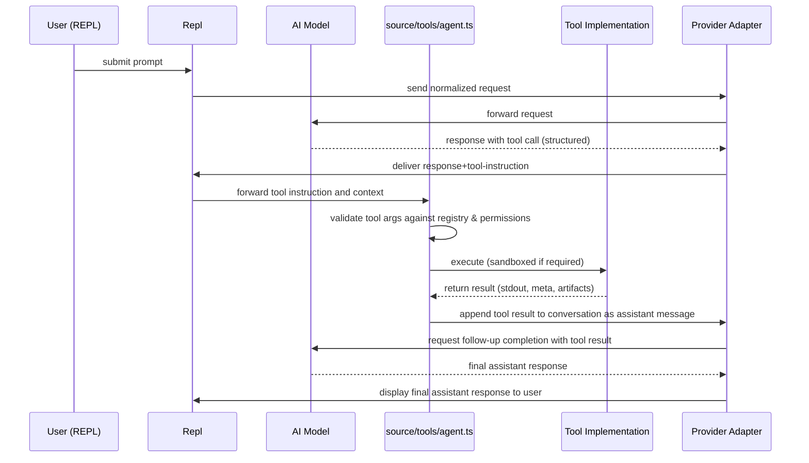

# Acai Architecture

This document outlines the architecture of the Acai CLI tool, an AI-powered command-line assistant for software development. It contains the project structure (excluding dot directories), an expanded file description list, and primary flow diagrams (Mermaid). Focused updates: more detailed file descriptions and additional diagrams for the tool execution loop.

## Project Structure

```
acai-ts
├── .gitignore
├── .ignore
├── .npmignore
├── AGENTS.md
├── ARCHITECTURE.md
├── LICENSE
├── README.md
├── TODO.md
├── biome.json
├── commitlint.config.js
├── knip.json
├── package-lock.json
├── package.json
├── source
│   ├── cli.ts
│   ├── commands
│   │   ├── application-log-command.ts
│   │   ├── clear-command.ts
│   │   ├── compact-command.ts
│   │   ├── copy-command.ts
│   │   ├── edit-command.ts
│   │   ├── edit-prompt-command.ts
│   │   ├── exit-command.ts
│   │   ├── files-command.ts
│   │   ├── generate-rules-command.ts
│   │   ├── health-command.ts
│   │   ├── help-command.ts
│   │   ├── init-command.ts
│   │   ├── last-log-command.ts
│   │   ├── manager.ts
│   │   ├── model-command.ts
│   │   ├── paste-command.ts
│   │   ├── prompt-command.ts
│   │   ├── reset-command.ts
│   │   ├── rules-command.ts
│   │   ├── save-command.ts
│   │   ├── types.ts
│   │   └── usage-command.ts
│   ├── config.ts
│   ├── conversation-analyzer.ts
│   ├── dedent.ts
│   ├── formatting.ts
│   ├── index.ts
│   ├── logger.ts
│   ├── mentions.ts
│   ├── messages.ts
│   ├── middleware
│   │   ├── audit-message.ts
│   │   ├── index.ts
│   │   └── rate-limit.ts
│   ├── models
│   │   ├── ai-config.ts
│   │   ├── anthropic-provider.ts
│   │   ├── deepseek-provider.ts
│   │   ├── google-provider.ts
│   │   ├── manager.ts
│   │   ├── openai-provider.ts
│   │   ├── openrouter-provider.ts
│   │   ├── providers.ts
│   │   └── xai-provider.ts
│   ├── parsing.ts
│   ├── prompts
│   │   └── manager.ts
│   ├── prompts.ts
│   ├── repl-prompt.ts
│   ├── repl.ts
│   ├── saved-selections
│   ├── terminal
│   │   ├── formatting.ts
│   │   ├── index.ts
│   │   ├── markdown-utils.ts
│   │   ├── markdown.ts
│   │   ├── supports-color.ts
│   │   ├── supports-hyperlinks.ts
│   │   └── types.ts
│   ├── terminal-output.test.ts
│   ├── token-tracker.ts
│   ├── token-utils.ts
│   ├── tools
│   │   ├── agent.ts
│   │   ├── bash.ts
│   │   ├── code-interpreter.ts
│   │   ├── command-validation.ts
│   │   ├── delete-file.ts
│   │   ├── directory-tree.ts
│   │   ├── edit-file.ts
│   │   ├── filesystem-utils.ts
│   │   ├── git-utils.ts
│   │   ├── grep.ts
│   │   ├── index.ts
│   │   ├── move-file.ts
│   │   ├── read-file.ts
│   │   ├── read-multiple-files.ts
│   │   ├── save-file.ts
│   │   ├── think.ts
│   │   ├── types.ts
│   │   ├── web-fetch.ts
│   │   └── web-search.ts
│   ├── utils
│   │   └── process.ts
│   └── version.ts
├── test
│   ├── commands
│   │   ├── copy-command.test.ts
│   │   └── health-command.test.ts
│   ├── config.test.ts
│   ├── terminal
│   │   └── markdown-utils.test.ts
│   └── tools
│       ├── bash-tool.test.ts
│       ├── code-interpreter.test.ts
│       ├── command-validation.test.ts
│       └── grep.test.ts
├── tsconfig.build.json
└── tsconfig.json
```

Notes:
- Dot directories (e.g., .acai, .github, .husky) are intentionally omitted from the tree and file descriptions per the request.

## File Descriptions (expanded)

This section expands descriptions for the most important files and modules. Files are grouped by purpose with actionable notes about responsibilities, inputs/outputs, and security considerations.

Top-level
- package.json — Defines package metadata, scripts (build/dev/test), and binaries. Entry points:
  - bin.acai -> dist/index.js (production binary)
  - scripts.dev -> node ./source/index.ts (development runner)
  Security notes: contains no secrets. Build step compiles TypeScript -> dist.
- README.md — Usage examples and quickstart. Primary onboarding document for contributors.
- AGENTS.md — Rules and behavioral guidance the agent follows. Edited by `init-command` and `generate-rules-command`.
- biome.json / commitlint.config.js / knip.json — Tooling configs (format/lint/commit rules/unused export checks).

source/index.ts and CLI
- source/index.ts — App bootstrap. Responsibilities:
  - Parse environment and CLI args (delegates to source/cli.ts for parsing in dev flow)
  - Initialize core subsystems (config, logger, model manager, prompt/agent, tools)
  - Instantiate and enter REPL loop via Repl class
  Important: calls into source/models/manager.ts to register providers and source/tools/index.ts to expose tools to the agent.
- source/cli.ts — Thin wrapper used by the dev script and possibly for non-REPL invocations. Parses high-level flags (e.g., --version, --no-color) and forwards to index.

Configuration & logging
- source/config.ts — Loads configuration from multiple layered sources: repository-level, user-level (~/.config), and environment. Validates shape with Zod where applicable.
- source/logger.ts — Configures pino logger and file transport (rotating) via pino-roll. Exposes logger used across modules. Security: ensures logs do not include raw secrets.

REPL, prompts, messages
- source/repl.ts — Manages the main interactive loop. Responsibilities:
  - Listen for user input
  - Route slash-commands to CommandManager
  - For non-command input, construct prompt payload and submit to ModelManager
  - Handle streaming responses and tool-invocation flows
- source/repl-prompt.ts — Encapsulates interactive features: history, tab-completion, and enhanced prompt behaviors (used by Repl).
- source/prompts.ts — Builds system/assistant messages based on AGENTS.md, project context, mentions, and token budgets.
- source/prompts/manager.ts — Stores and retrieves saved prompts and templates.
- source/messages.ts — Conversation history persistence and summarization; invoked by save/compact/reset commands.

Commands
- source/commands/manager.ts — Registers commands (files in source/commands). Exposes resolve/execute API used by repl.ts. Validates input and enforces command argument patterns.
- Individual command files (e.g., save-command.ts, edit-command.ts) — Each exports a handler implementing the standard CommandHandler interface (from types.ts). Handlers are synchronous or async, must return structured CommandResult for consistent REPL rendering.
- Security: commands that touch filesystem use tools/filesystem-utils.ts and validate paths against repository root to avoid accidental deletion outside repo.

Middleware
- source/middleware/index.ts — Exposes middleware stack used when sending requests to AI providers. Middleware can mutate requests or responses.
- audit-message.ts — Logs metadata about requests/responses (no PII).
- rate-limit.ts — Enforces concurrency and rate limits for provider calls to avoid provider throttling.

Models & provider adapters
- source/models/manager.ts — ModelManager selects a provider and model based on configuration, prompt complexity, and ai-config capabilities. It normalizes requests into a provider-agnostic shape.
- source/models/ai-config.ts — Detects model capabilities and provides dynamic parameter defaults (e.g., tokens, temperature bounds).
- source/models/*-provider.ts — Adapter per provider that translates the normalized request to provider SDK calls and adapts streaming/tool metadata back to the unified format. Includes:
  - openai-provider.ts
  - openrouter-provider.ts
  - anthropic-provider.ts
  - google-provider.ts
  - deepseek-provider.ts
  - xai-provider.ts
  Each adapter handles authentication (via environment variables), rate limits, and provider-specific streaming logic.

Tools (detailed)
Context: Tools are used when the model's response includes a structured tool call. The agent coordinates tool invocation via source/tools/agent.ts and exposes implementations in source/tools/*. Tools follow a strict contract (input shape, allowed paths, result shape).

- source/tools/index.ts — Tool registry and factory used by agent.ts and tests to look up tool implementations. Ensures tools are whitelisted and validates arguments before execution.
- source/tools/agent.ts — Orchestrates tool invocation requested by the model. Responsibilities:
  - Validate tool request against registry and permissions
  - Execute tool in a sandboxed or restricted environment when necessary (e.g., code-interpreter uses a separate process)
  - Capture stdout/stderr and structured results
  - Return results to model as context for follow-up completions
- source/tools/bash.ts — Executes a limited set of allowed shell commands using child_process. Whitelist is enforced in command-validation.ts and filesystem-utils.ts to prevent dangerous operations. Output is captured, sanitized, and truncated to token budget.
- source/tools/code-interpreter.ts — Runs JS in a child Node process with restricted permissions (cwd limited to repo temp, input sanitized). Returns structured output and any artifacts produced.
- source/tools/read-file.ts / save-file.ts / edit-file.ts / delete-file.ts / move-file.ts — File ops with path validation and atomic writes. Each returns success/failure plus a short result summary and optionally file diffs.
- source/tools/directory-tree.ts / grep.ts — Project introspection tools used to build context for prompts (e.g., provide file lists or search results). grep.ts leverages ripgrep CLI via child_process for speed.
- source/tools/web-fetch.ts / web-search.ts — Fetch content from the web. Responses are sanitized (strip scripts, limit HTML size) and truncated to token budgets.
- source/tools/think.ts — Non-functional logger to capture agent 'thoughts' for debugging. Stored separately from main message logs.

Utilities & tests
- source/utils/process.ts — Promise wrapper around child_process.execFile with strict arguments and timeout handling.
- token-utils.ts / token-tracker.ts — Integrations with tiktoken to estimate and account for token usage; used by prompts and usage-command.
- Tests under test/ validate command and tool behaviors and are executed with the project's test runner in package.json.

Security & safety notes
- All tools validate file paths against the repository root.
- Execution of shell or code tools is restricted by whitelists and by executing in child processes with limited environments.
- Logs redact environment variables and avoid writing secrets to persistent logs.

## Flow Diagram

package.json defines the runtime entry points:
- bin.acai -> dist/index.js (compiled from source/index.ts)
- scripts.dev -> node ./source/index.ts (run directly from source for development)

Primary flows are described below. Existing REPL and startup diagrams are preserved; the following adds detailed diagrams for tool execution and the tool sandbox lifecycle.

### Application startup and REPL (binary path)

```mermaid
graph TD
  A[User runs `acai` binary] --> B[Node executes dist/index.js]
  B --> C[Bootstrap runtime]
  C --> D[Load configuration (source/config.ts)]
  D --> E[Initialize logging (source/logger.ts)]
  E --> F[Initialize ModelManager (source/models/manager.ts)]
  F --> G[Initialize PromptManager & MessageHistory]
  G --> H[Instantiate CommandManager and REPL (source/repl.ts)]
  H --> I[Enter REPL loop (wait for user input)]
```

### Tool execution loop (model-initiated tool calls)



Notes:
- The Agent acts as the arbiter for tool permissions and argument validation.
- Provider adapters are responsible for preserving streaming behavior and tool metadata between the model and the agent.

### Tool sandbox & lifecycle (detailed)

```mermaid
graph TB
  A[Agent receives tool request] --> B{Tool requires sandbox?}
  B -- Yes --> C[Create temp working dir (repo-scoped)]
  C --> D[Spawn child process with restricted env & timeout]
  B -- No --> E[Execute in-process with argument validation]
  D --> F[Capture stdout/stderr, exit code]
  E --> F
  F --> G[Sanitize and truncate output to token budget]
  G --> H[Store artifacts (if any) to temp and return references]
  H --> I[Return structured result to Agent]
  I --> J[Agent appends result to conversation and requests model to continue]
```

Security controls shown:
- Sandbox temp dir is created inside repository or system temp with strict cleanup.
- Child processes have reduced PATH and environment variables and are invoked with timeout.
- Outputs are truncated to respect token budgets before being sent back to the model.

### Command / non-tool user input handling (preserved)

```mermaid
graph TD
  A[User types input] --> B{Input starts with `/`}
  B -- Yes --> C[CommandManager resolves handler]
  C --> D[Run command handler (source/commands/*)]
  D --> E[Handler returns output -> display to user]
  B -- No --> F[Build message payload (mentions, system prompt)]
  F --> G[ModelManager selects provider & model]
  G --> H[Send request to provider adapter (source/models/*-provider.ts)]
  H --> I[Receive model response]
  I --> J{Response requests tool usage}
  J -- Yes --> K[Execute tools (source/tools/*) and feed results back to model]
  J -- No --> L[Store/display assistant response]
  L --> M[Update MessageHistory & token accounting]
```
