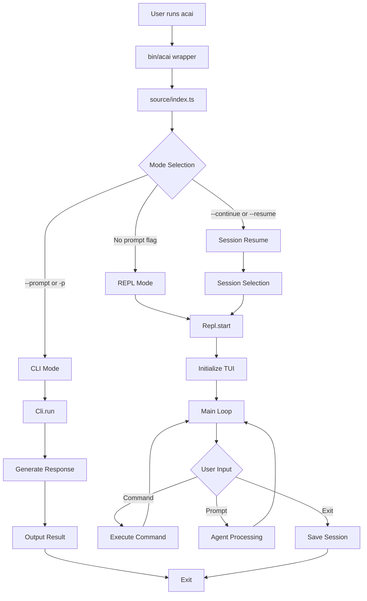
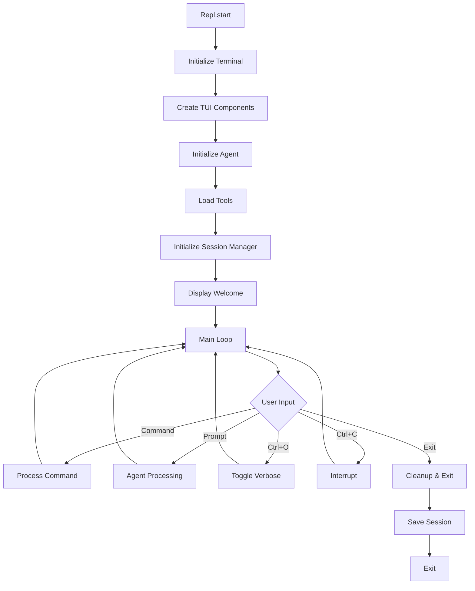
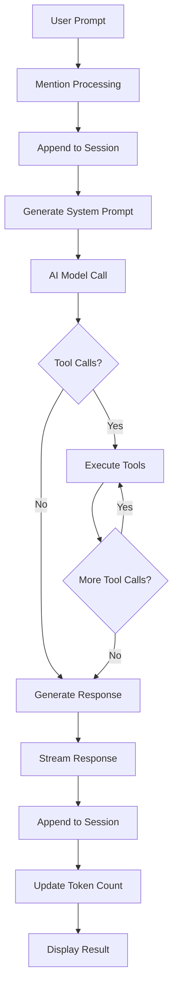
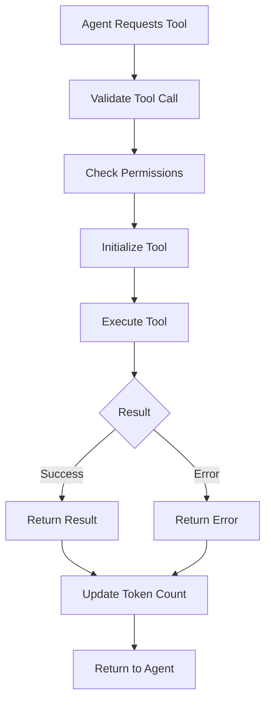
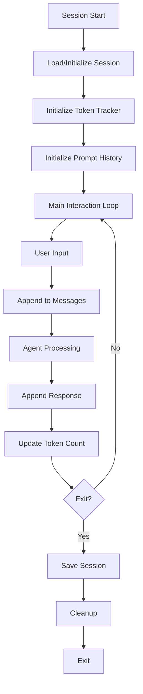
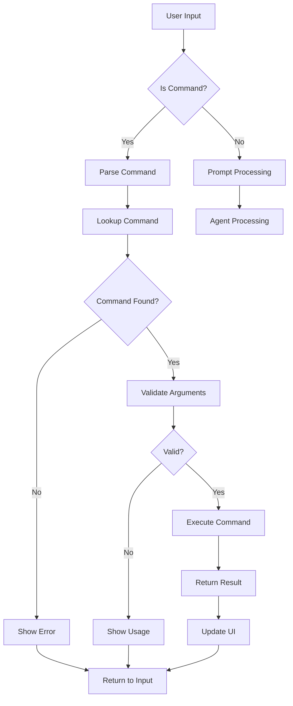
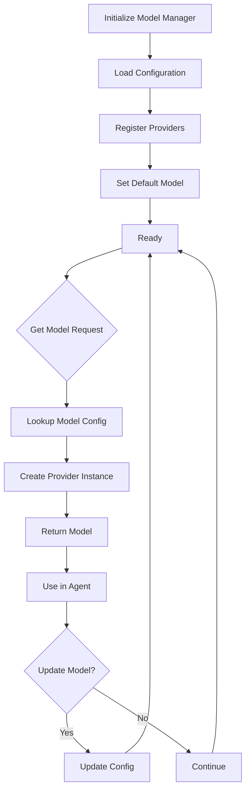
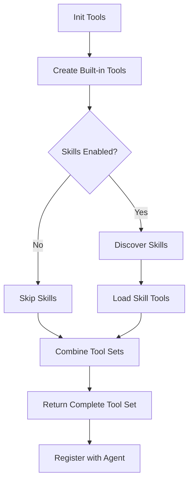
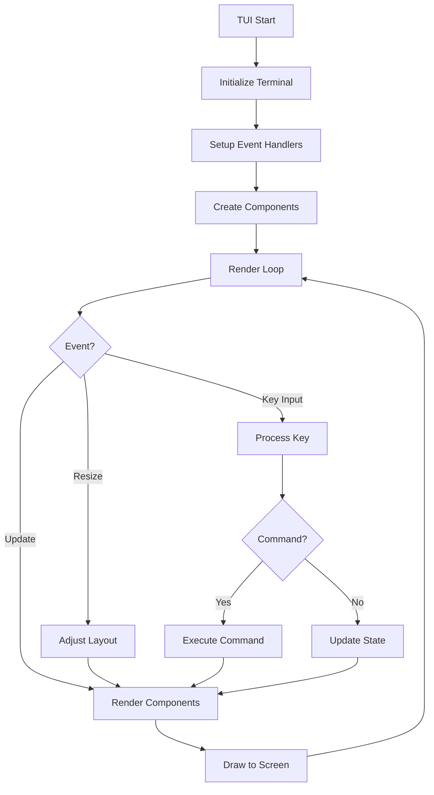
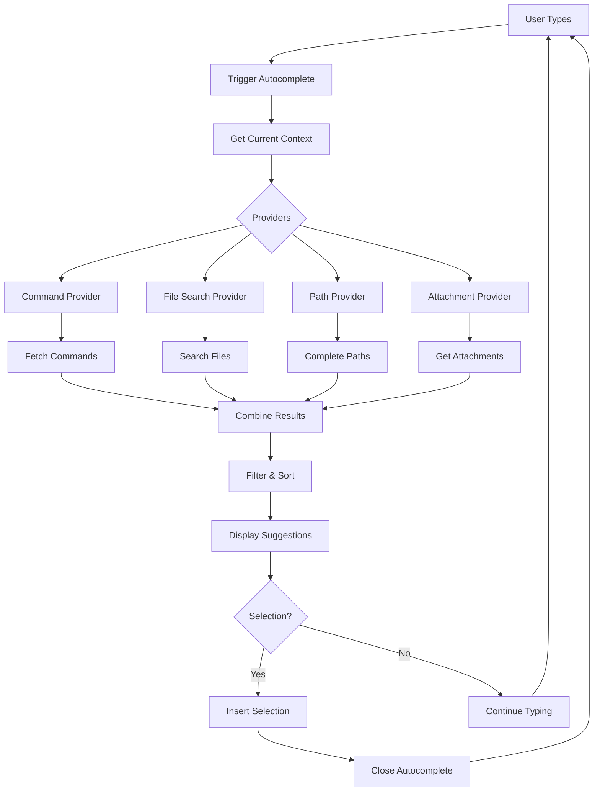

# Acai Architecture

This document outlines the architecture of the Acai CLI tool, an AI-powered command-line assistant for software development. It contains the project structure (excluding dot directories), a comprehensive list of file descriptions, and primary flow diagrams using Mermaid. Updates reflect the current project state as of the latest directory scan.

## Project Structure

```
acai-ts
├── AGENTS.md
├── ARCHITECTURE.md
├── LICENSE
├── README.md
├── TODO.md
├── benchmark-cache.sh
├── biome.json
├── commitlint.config.js
├── knip.json
├── package-lock.json
├── package.json
├── plan.md
├── prompt.md
├── scripts
│   └── show-config.ts
├── specs
│   ├── background-resume.md
│   ├── cli-stdin-handling.md
│   ├── footer-restructure.md
│   ├── session-storage.md
│   ├── session-token-usage.md
│   ├── share-command.md
│   └── template.md
├── temp
│   ├── ANALYSIS.md
│   ├── COMMANDS-TO-DEPRECATE.md
│   ├── MARKDOWN-PLAN.md
│   ├── MARKDOWN_REFACTOR_PLAN.md
│   ├── PI-CA-TUI.md
│   ├── PI-TUI-SOURCE.md
│   ├── REVIEW.md
│   ├── SOURCE.md
│   ├── UPDATED-PI-SOURCE.md
│   ├── UPDATED-PI-CA_SOURCE.md
│   ├── add-docs.md
│   ├── autocomplete.md
│   ├── autocomplete_plan.md
│   ├── cursor_markdown_parsing_implementation.md
│   ├── generate-prompts.ts
│   ├── hooks_feature.md
│   ├── hooks_feature2.md
│   ├── new-code-executor.md
│   ├── ralph.sh
│   ├── system-prompt-cli.md
│   ├── system-prompt-full.md
│   ├── system-prompt-minimal.md
│   ├── system-prompts-comparison.md
│   ├── test-coverage-progress.txt
│   ├── test-coverage.sh
│   └── test-side-effects.md
├── tsconfig.build.json
└── tsconfig.json
├── bin
│   └── acai
└── source
    ├── agent
    │   ├── index.ts
    │   └── sub-agent.ts
    ├── cli.ts
    ├── commands
    │   ├── add-directory
    │   │   ├── index.ts
    │   │   ├── types.ts
    │   │   └── utils.ts
    │   ├── clear
    │   │   └── index.ts
    │   ├── copy
    │   │   ├── index.ts
    │   │   ├── types.ts
    │   │   └── utils.ts
    │   ├── generate-rules
    │   │   ├── index.ts
    │   │   └── utils.ts
    │   ├── handoff
    │   │   ├── index.ts
    │   │   └── utils.ts
    │   ├── health
    │   │   ├── index.ts
    │   │   └── utils.ts
    │   ├── help
    │   │   └── index.ts
    │   ├── history
    │   │   ├── index.ts
    │   │   ├── types.ts
    │   │   └── utils.ts
    │   ├── init
    │   │   └── index.ts
    │   ├── init-project
    │   │   ├── index.ts
    │   │   └── utils.ts
    │   ├── list-directories
    │   │   └── index.ts
    │   ├── list-tools
    │   │   └── index.ts
    │   ├── manager.ts
    │   ├── model
    │   │   ├── index.ts
    │   │   └── utils.ts
    │   ├── paste
    │   │   ├── index.ts
    │   │   └── utils.ts
    │   ├── pickup
    │   │   ├── index.ts
    │   │   ├── types.ts
    │   │   └── utils.ts
    │   ├── remove-directory
    │   │   └── index.ts
    │   ├── resources
    │   │   └── index.ts
    │   ├── review
    │   │   ├── index.ts
    │   │   ├── types.ts
    │   │   └── utils.ts
    │   ├── session
    │   │   ├── index.ts
    │   │   └── types.ts
    │   ├── share
    │   │   ├── html-renderer.ts
    │   │   └── index.ts
    │   ├── shell
    │   │   └── index.ts
    │   └── types.ts
    ├── config.ts
    ├── dedent.ts
    ├── execution
    │   └── index.ts
    ├── formatting.ts
    ├── index.ts
    ├── logger.ts
    ├── mentions.ts
    ├── middleware
    │   ├── audit-message.ts
    │   ├── cache.ts
    │   ├── index.ts
    │   └── rate-limit.ts
    ├── models
    │   ├── ai-config.ts
    │   ├── anthropic-provider.ts
    │   ├── deepseek-provider.ts
    │   ├── google-provider.ts
    │   ├── groq-provider.ts
    │   ├── manager.ts
    │   ├── openai-provider.ts
    │   ├── opencode-zen-provider.ts
    │   ├── openrouter-provider.ts
    │   ├── providers.ts
    │   └── xai-provider.ts
    ├── parsing.ts
    ├── prompts
    │   └── manager.ts
    ├── prompts.ts
    ├── repl
    │   └── project-status.ts
    ├── repl.ts
    ├── sessions
    │   └── manager.ts
    ├── skills.ts
    ├── stdin.ts
    ├── subagents.ts
    ├── terminal
    │   ├── ansi-styles.ts
    │   ├── control.ts
    │   ├── default-theme.ts
    │   ├── east-asian-width.ts
    │   ├── formatting.ts
    │   ├── highlight
    │   │   ├── index.ts
    │   │   └── theme.ts
    │   ├── index.ts
    │   ├── keys.ts
    │   ├── markdown-utils.ts
    │   ├── segmenter.ts
    │   ├── select-prompt.ts
    │   ├── string-width.ts
    │   ├── strip-ansi.ts
    │   ├── style.ts
    │   ├── supports-color.ts
    │   ├── supports-hyperlinks.ts
    │   ├── table
    │   │   ├── cell.ts
    │   │   ├── debug.ts
    │   │   ├── index.ts
    │   │   ├── layout-manager.ts
    │   │   ├── table.ts
    │   │   └── utils.ts
    │   └── wrap-ansi.ts
    ├── tokens
    │   ├── counter.ts
    │   └── tracker.ts
    ├── tools
    │   ├── agent.ts
    │   ├── bash.ts
    │   ├── directory-tree.ts
    │   ├── edit-file.ts
    │   ├── glob.ts
    │   ├── grep.ts
    │   ├── index.ts
    │   ├── ls.ts
    │   ├── read-file.ts
    │   ├── save-file.ts
    │   ├── skill.ts
    │   ├── think.ts
    │   ├── types.ts
    │   ├── utils.ts
    │   ├── web-fetch.ts
    │   └── web-search.ts
    ├── tui
    │   ├── autocomplete
    │   │   ├── attachment-provider.ts
    │   │   ├── base-provider.ts
    │   │   ├── combined-provider.ts
    │   │   ├── command-provider.ts
    │   │   ├── file-search-provider.ts
    │   │   ├── path-provider.ts
    │   │   └── utils.ts
    │   ├── autocomplete.ts
    │   ├── components
    │   │   ├── assistant-message.ts
    │   │   ├── box.ts
    │   │   ├── editor.ts
    │   │   ├── footer.ts
    │   │   ├── header.ts
    │   │   ├── input.ts
    │   │   ├── loader.ts
    │   │   ├── markdown.ts
    │   │   ├── modal.ts
    │   │   ├── notification.ts
    │   │   ├── progress-bar.ts
    │   │   ├── select-list.ts
    │   │   ├── spacer.ts
    │   │   ├── table.ts
    │   │   ├── text.ts
    │   │   ├── thinking-block.ts
    │   │   ├── tool-execution.ts
    │   │   ├── user-message.ts
    │   │   └── welcome.ts
    │   ├── editor-launcher.ts
    │   ├── index.ts
    │   ├── terminal.ts
    │   ├── tui-output.test.ts
    │   ├── tui.ts
    │   └── utils.ts
    └── utils
        ├── bash.ts
        ├── filesystem
        │   ├── operations.ts
        │   ├── path-display.ts
        │   └── security.ts
        ├── filetype-detection.ts
        ├── funcs.ts
        ├── generators.ts
        ├── git.ts
        ├── glob.ts
        ├── ignore.ts
        ├── iterables.ts
        ├── process.ts
        ├── templates.ts
        ├── yaml.ts
        └── zod.ts
└── test
    ├── agent
    ├── commands
    │   ├── add-directory.test.ts
    │   ├── clear-command.test.ts
    │   ├── copy-command.test.ts
    │   ├── generate-rules.test.ts
    │   ├── handoff.test.ts
    │   ├── health.test.ts
    │   ├── history-command.integration.test.ts
    │   ├── history-command.test.ts
    │   ├── init-project.test.ts
    │   ├── list-directories.test.ts
    │   ├── list-tools.test.ts
    │   ├── model.test.ts
    │   ├── paste.test.ts
    │   ├── pickup.test.ts
    │   ├── prompt-command.test.ts
    │   ├── remove-directory.test.ts
    │   ├── resources-command.test.ts
    │   ├── review-command.test.ts
    │   ├── review.test.ts
    │   ├── session-command.test.ts
    │   ├── share.test.ts
    │   └── shell-command.test.ts
    ├── config.test.ts
    ├── execution.test.ts
    ├── integration
    ├── mentions.test.ts
    ├── messages.test.ts
    ├── models
    │   ├── ai-config.test.ts
    │   └── manager.test.ts
    ├── sessions
    │   └── manager.test.ts
    ├── setup.js
    ├── stdin-handling.test.ts
    ├── terminal
    │   ├── highlight.test.ts
    │   ├── keys.test.ts
    │   └── markdown-utils.test.ts
    ├── tokens
    ├── tools
    │   ├── bash.test.ts
    │   ├── edit-file.test.ts
    │   ├── glob.test.ts
    │   ├── grep-enhanced-ux.test.ts
    │   ├── grep-error-handling.test.ts
    │   ├── grep-issue-96.test.ts
    │   ├── grep-match-counting.test.ts
    │   ├── grep-max-results.test.ts
    │   ├── grep.test.ts
    │   ├── ls.test.ts
    │   └── web-search.test.ts
    ├── tui
    │   ├── autocomplete.test.ts
    │   ├── components
    │   │   ├── select-list.test.ts
    │   │   └── table.test.ts
    │   ├── modal.test.ts
    │   ├── tool-execution-race-condition.test.ts
    │   └── tool-execution-synthetic-start.test.ts
    └── utils
        ├── bash.test.ts
        ├── filesystem
        │   ├── path-display.test.ts
        │   └── security.test.ts
        ├── filesystem.test.ts
        ├── generators.test.ts
        ├── glob.test.ts
        ├── ignore.test.ts
        ├── mocking.ts
        ├── model-manager.ts
        ├── process.test.ts
        └── test-fixtures.ts
```

## File Descriptions

### Root Configuration Files

- **AGENTS.md**: Agent configuration and behavior guidelines for the AI assistant
- **ARCHITECTURE.md**: This file - comprehensive architecture documentation
- **LICENSE**: MIT license for the project
- **README.md**: Project documentation and usage instructions
- **TODO.md**: Outstanding tasks and planned features
- **biome.json**: Biome linting and formatting configuration
- **commitlint.config.js**: Commit message linting configuration
- **knip.json**: Knip dependency and code analysis configuration
- **package.json**: NPM package configuration with scripts and dependencies
- **package-lock.json**: NPM dependency lockfile
- **plan.md**: Project planning documentation
- **prompt.md**: System prompt template
- **tsconfig.json**: TypeScript compiler configuration
- **tsconfig.build.json**: TypeScript build configuration

### Scripts

- **scripts/show-config.ts**: Utility script to display current configuration

### Specs

- **specs/background-resume.md**: Specification for session background resumption
- **specs/cli-stdin-handling.md**: Specification for CLI stdin input handling
- **specs/footer-restructure.md**: Footer component restructure specification
- **specs/session-storage.md**: Session persistence and storage specification
- **specs/session-token-usage.md**: Token usage tracking for sessions
- **specs/share-command.md**: Share command feature specification
- **specs/template.md**: Template for new specifications

### Temp

- **temp/**: Temporary working directory for analysis and planning documents

### Bin

- **bin/acai**: Shell wrapper script for the CLI with Node.js compile cache support

### Source - Core

- **source/index.ts**: Main entry point, handles CLI argument parsing and mode selection
- **source/cli.ts**: CLI mode handler for single-prompt execution
- **source/repl.ts**: REPL mode handler for interactive terminal UI
- **source/config.ts**: Configuration management and loading
- **source/logger.ts**: Logging infrastructure using Pino
- **source/dedent.ts**: Utility for dedenting multi-line strings
- **source/formatting.ts**: Text formatting utilities
- **source/mentions.ts**: Processes @mentions in prompts
- **source/parsing.ts**: Text parsing utilities
- **source/prompts.ts**: System prompt generation
- **source/skills.ts**: Skills discovery and loading
- **source/stdin.ts**: Standard input reading utilities
- **source/subagents.ts**: Subagent management
- **source/version.ts**: Package version retrieval

### Source - Agent

- **source/agent/index.ts**: Main agent implementation for AI interactions
- **source/agent/sub-agent.ts**: Subagent implementation for specialized tasks

### Source - Commands

- **source/commands/manager.ts**: Command registration and execution manager
- **source/commands/types.ts**: Shared command type definitions
- **source/commands/add-directory/**: Command to add working directories
- **source/commands/clear/**: Command to clear the conversation
- **source/commands/copy/**: Command to copy content
- **source/commands/generate-rules/**: Command to generate project rules
- **source/commands/handoff/**: Command for agent handoffs
- **source/commands/health/**: Command to check system health
- **source/commands/help/**: Command to display help information
- **source/commands/history/**: Command to view conversation history
- **source/commands/init/**: Command to initialize acai configuration
- **source/commands/init-project/**: Command to initialize a new project
- **source/commands/list-directories/**: Command to list working directories
- **source/commands/list-tools/**: Command to list available tools
- **source/commands/model/**: Command to manage AI model configuration
- **source/commands/paste/**: Command to paste clipboard content
- **source/commands/pickup/**: Command to resume from saved state
- **source/commands/remove-directory/**: Command to remove working directories
- **source/commands/resources/**: Command to manage resources
- **source/commands/review/**: Command to review code
- **source/commands/session/**: Command to manage sessions
- **source/commands/share/**: Command to share conversations
- **source/commands/shell/**: Command to execute shell commands

### Source - Models

- **source/models/manager.ts**: Model lifecycle and configuration management
- **source/models/ai-config.ts**: AI model configuration abstraction
- **source/models/providers.ts**: Provider and model type definitions
- **source/models/anthropic-provider.ts**: Anthropic Claude provider
- **source/models/deepseek-provider.ts**: DeepSeek provider
- **source/models/google-provider.ts**: Google Gemini provider
- **source/models/groq-provider.ts**: Groq provider
- **source/models/openai-provider.ts**: OpenAI provider
- **source/models/opencode-zen-provider.ts**: OpenCode Zen provider
- **source/models/openrouter-provider.ts**: OpenRouter provider
- **source/models/xai-provider.ts**: xAI Grok provider

### Source - Tools

- **source/tools/index.ts**: Tool initialization and registry
- **source/tools/types.ts**: Tool type definitions
- **source/tools/utils.ts**: Tool utility functions
- **source/tools/agent.ts**: Agent tool for invoking sub-agents
- **source/tools/bash.ts**: Bash command execution tool
- **source/tools/directory-tree.ts**: Directory tree generation tool
- **source/tools/edit-file.ts**: File editing tool
- **source/tools/glob.ts**: File pattern matching tool
- **source/tools/grep.ts**: Text search tool
- **source/tools/ls.ts**: Directory listing tool
- **source/tools/read-file.ts**: File reading tool
- **source/tools/save-file.ts**: File writing tool
- **source/tools/skill.ts**: Skill invocation tool
- **source/tools/think.ts**: Thinking/reasoning tool
- **source/tools/web-search.ts**: Web search tool using Exa API with DuckDuckGo fallback
- **source/tools/web-fetch.ts**: Web content fetch tool with HTML cleaning (Jina AI or local Cheerio-based)

### Source - Terminal

- **source/terminal/index.ts**: Terminal utilities exports
- **source/terminal/terminal.ts**: Terminal interface abstraction
- **source/terminal/control.ts**: Terminal control functions (clear, cursor, etc.)
- **source/terminal/select-prompt.ts**: Interactive selection prompt
- **source/terminal/ansi-styles.ts**: ANSI color and style codes
- **source/terminal/default-theme.ts**: Default terminal theme
- **source/terminal/east-asian-width.ts**: East Asian character width handling
- **source/terminal/formatting.ts**: Terminal formatting utilities
- **source/terminal/keys.ts**: Keyboard key definitions
- **source/terminal/markdown-utils.ts**: Markdown rendering utilities
- **source/terminal/segmenter.ts**: Text segmentation utilities
- **source/terminal/string-width.ts**: String width calculation
- **source/terminal/strip-ansi.ts**: ANSI code removal
- **source/terminal/style.ts**: Terminal styling utilities
- **source/terminal/supports-color.ts**: Color support detection
- **source/terminal/supports-hyperlinks.ts**: Hyperlink support detection
- **source/terminal/wrap-ansi.ts**: ANSI-aware text wrapping
- **source/terminal/highlight/**: Syntax highlighting
- **source/terminal/table/**: Table rendering components

### Source - TUI

- **source/tui/index.ts**: TUI component exports
- **source/tui/tui.ts**: Main TUI controller
- **source/tui/terminal.ts**: Terminal adapter for TUI
- **source/tui/utils.ts**: TUI utility functions
- **source/tui/editor-launcher.ts**: External editor launcher
- **source/tui/autocomplete.ts**: Autocomplete system
- **source/tui/autocomplete/**: Autocomplete providers
- **source/tui/components/**: Reusable TUI components (box, editor, footer, header, input, loader, markdown, modal, notification, progress-bar, select-list, spacer, table, text, thinking-block, tool-execution, assistant-message, user-message, welcome)

### Source - Utils

- **source/utils/bash.ts**: Bash command utilities
- **source/utils/filetype-detection.ts**: File type detection
- **source/utils/funcs.ts**: General function utilities
- **source/utils/generators.ts**: Generator utilities
- **source/utils/git.ts**: Git-related utilities
- **source/utils/glob.ts**: Glob pattern utilities
- **source/utils/ignore.ts**: Gitignore-style pattern matching
- **source/utils/iterables.ts**: Iterable utilities
- **source/utils/process.ts**: Process utilities
- **source/utils/templates.ts**: Argument placeholder substitution for skill/prompt content
- **source/utils/yaml.ts**: YAML parsing utilities
- **source/utils/zod.ts**: Zod schema utilities
- **source/utils/filesystem/**: Filesystem operations and security

### Source - Other

- **source/prompts/manager.ts**: Prompt template management
- **source/repl/project-status.ts**: Project status display
- **source/sessions/manager.ts**: Session lifecycle management
- **source/tokens/counter.ts**: Token counting utilities
- **source/tokens/tracker.ts**: Token usage tracking
- **source/middleware/**: Middleware for AI interactions (audit, cache, rate-limit)
- **source/execution/**: Command execution handling

### Test

- **test/setup.js**: Test setup and configuration
- **test/agent/**: Agent-related tests
- **test/commands/**: Command tests
- **test/config.test.ts**: Configuration tests
- **test/execution.test.ts**: Execution tests
- **test/integration/**: Integration tests
- **test/mentions.test.ts**: Mention processing tests
- **test/messages.test.ts**: Message handling tests
- **test/models/**: Model management tests
- **test/sessions/**: Session management tests
- **test/stdin-handling.test.ts**: Stdin handling tests
- **test/terminal/**: Terminal utility tests
- **test/tokens/**: Token tracking tests
- **test/tools/**: Tool tests
- **test/tui/**: TUI component tests
- **test/utils/**: Utility function tests

## Flow Diagram

### Main Entry Point Flow



### REPL Mode Flow



### Agent Processing Flow



### Tool Execution Flow



### Session Management Flow



### Command Execution Flow



### Model Manager Flow



### Tool Initialization Flow



### TUI Rendering Flow



### Autocomplete Flow

