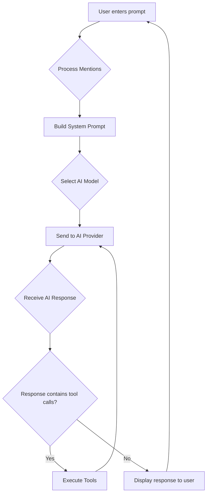
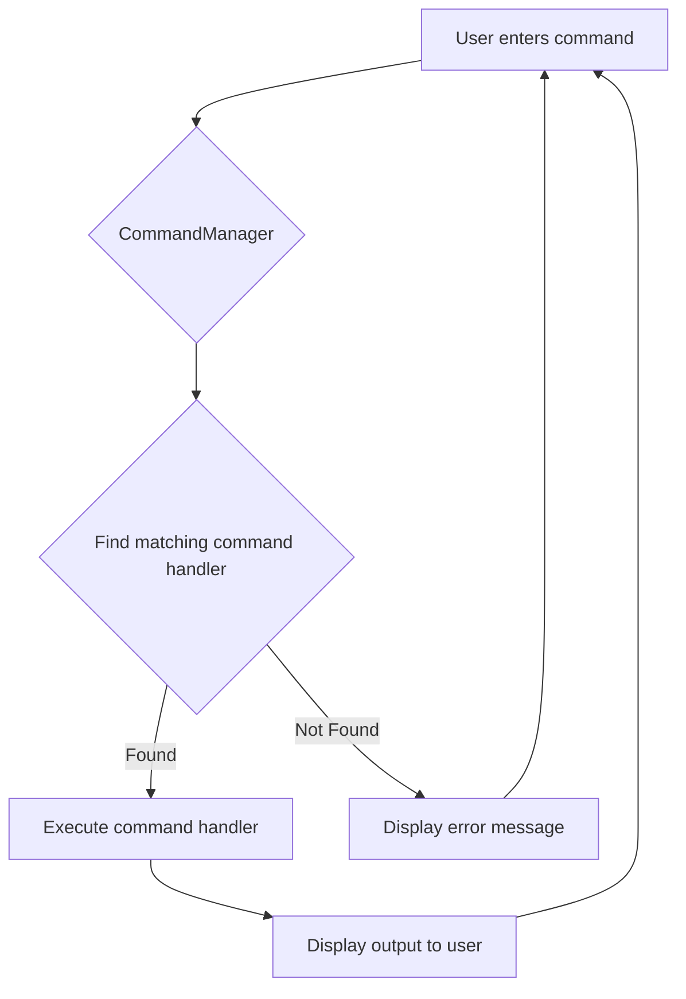

# Acai Architecture

This document outlines the architecture of the Acai CLI tool, a powerful AI-driven software development assistant. It details the project structure, provides descriptions for each file, and illustrates the primary application flows with Mermaid diagrams.

## Project Structure

```
├── acai-ts
│   ├── .acai
│   │   ├── acai.json
│   │   ├── memory
│   │   ├── prompts
│   │   │   └── update-architecture-document.md
│   │   ├── rules
│   │   │   └── learned-rules.md
│   ├── .gitignore
│   ├── .ignore
│   ├── AGENTS.md
│   ├── ARCHITECTURE.md
│   ├── LICENSE
│   ├── README.md
│   ├── TODO.md
│   ├── biome.json
│   ├── docs
│   ├── knip.json
│   ├── package-lock.json
│   ├── package.json
│   ├── source
│   │   ├── cli.ts
│   │   ├── commands
│   │   │   ├── application-log-command.ts
│   │   │   ├── clean-repo.ts
│   │   │   ├── clear-command.ts
│   │   │   ├── commit-command.ts
│   │   │   ├── compact-command.ts
│   │   │   ├── edit-command.ts
│   │   │   ├── edit-prompt-command.ts
│   │   │   ├── exit-command.ts
│   │   │   ├── files-command.ts
│   │   │   ├── generate-rules-command.ts
│   │   │   ├── help-command.ts
│   │   │   ├── init-command.ts
│   │   │   ├── last-log-command.ts
│   │   │   ├── manager.ts
│   │   │   ├── model-command.ts
│   │   │   ├── paste-command.ts
│   │   │   ├── pr-comments-command.ts
│   │   │   ├── prompt-command.ts
│   │   │   ├── ptree-command.ts
│   │   │   ├── reset-command.ts
│   │   │   ├── review-command.ts
│   │   │   ├── rules-command.ts
│   │   │   ├── save-command.ts
│   │   │   ├── types.ts
│   │   │   ├── usage-command.ts
│   │   ├── config.ts
│   │   ├── conversation-analyzer.ts
│   │   ├── dedent.ts
│   │   ├── formatting.ts
│   │   ├── index.ts
│   │   ├── logger.ts
│   │   ├── mentions.ts
│   │   ├── messages.ts
│   │   ├── middleware
│   │   │   ├── audit-message.ts
│   │   │   ├── index.ts
│   │   │   ├── rate-limit.ts
│   │   ├── models
│   │   │   ├── ai-config.ts
│   │   │   ├── anthropic-provider.ts
│   │   │   ├── deepseek-provider.ts
│   │   │   ├── google-provider.ts
│   │   │   ├── manager.ts
│   │   │   ├── openai-provider.ts
│   │   │   ├── openrouter-provider.ts
│   │   │   ├── providers.ts
│   │   │   ├── reasoning.ts
│   │   │   └── xai-provider.ts
│   │   ├── parsing.ts
│   │   ├── prompts
│   │   │   └── manager.ts
│   │   ├── prompts.ts
│   │   ├── repl-prompt.ts
│   │   ├── repl.ts
│   │   ├── saved-selections
│   │   ├── terminal
│   │   │   ├── formatting.ts
│   │   │   ├── index.ts
│   │   │   ├── markdown-utils.ts
│   │   │   ├── markdown.ts
│   │   │   └── types.ts
│   │   ├── token-tracker.ts
│   │   ├── token-utils.ts
│   │   ├── tools
│   │   │   ├── agent.ts
│   │   │   ├── bash.ts
│   │   │   ├── code-interpreter.ts
│   │   │   ├── delete-file.ts
│   │   │   ├── directory-tree.ts
│   │   │   ├── edit-file.ts
│   │   │   ├── filesystem-utils.ts
│   │   │   ├── git-utils.ts
│   │   │   ├── grep.ts
│   │   │   ├── index.ts
│   │   │   ├── memory-read.ts
│   │   │   ├── memory-write.ts
│   │   │   ├── move-file.ts
│   │   │   ├── read-file.ts
│   │   │   ├── read-multiple-files.ts
│   │   │   ├── save-file.ts
│   │   │   ├── think.ts
│   │   │   ├── types.ts
│   │   │   ├── undo-edit.ts
│   │   │   ├── web-fetch.ts
│   │   │   └── web-search.ts
│   │   ├── utils
│   │   │   └── process.ts
│   ├── test
│   │   ├── terminal
│   │   │   └── markdown-utils.test.ts
│   ├── tsconfig.json
```

## File Descriptions

| File Path | Description |
| :--- | :--- |
| **.acai** | This directory serves as the central location for Acai's internal state, configuration, and temporary files. |
| **acai.json** | This file contains project-specific configuration for the Acai CLI tool, including custom commands and tool settings. |
| **learned-rules.md** | This file stores rules learned by Acai based on user corrections and feedback, aiming to improve its future behavior. |
| **.gitignore** | This file specifies intentionally untracked files and directories that Git should ignore during version control. |
| **.ignore** | This file is likely used by file watching or search tools (like ripgrep) to specify files and directories to ignore beyond `.gitignore`. |
| **AGENTS.md** | This markdown file likely contains project-specific rules, guidelines, and commands for Acai to follow. |
| **ARCHITECTURE.md** | This document outlines the overall architecture and project structure of the Acai CLI tool. |
| **README.md** | This file provides a comprehensive overview of the Acai project, including its features, installation instructions, usage examples, and configuration details. |
| **TODO.md** | This markdown file lists tasks or features that are planned for future implementation within the project. |
| **biome.json** | This file is the configuration for the Biome tool, defining code formatting and linting rules for the project. |
| **knip.json** | This file is the configuration for Knip, a tool used to detect unused files, dependencies, and exports in the project. |
| **package-lock.json** | This file records the exact versions of all installed Node.js dependencies, ensuring reproducible builds across different environments. |
| **package.json** | This file defines project metadata (name, version), dependencies, development scripts, and binary entry points for the Node.js project. |
| **types.ts** | This file defines common TypeScript types and interfaces used across various modules within the application. |
| **utils.ts** | This file contains general utility functions that are used throughout the application. |
| **application-log-command.ts** | This file implements a REPL command related to viewing or managing application logs. |
| **clean-repo.ts** | This file implements a REPL command for cleaning the repository, likely removing temporary or generated files. |
| **clear-command.ts** | This file implements the `/clear` REPL command, which clears the terminal screen for the current session. |
| **commit-command.ts** | This file implements the `/commit` REPL command, used to generate Conventional Commits for current changes. |
| **compact-command.ts** | This file implements the `/compact` REPL command, which saves, summarizes, and then resets the chat history. |
| **edit-command.ts** | This file implements a REPL command for editing files directly within the interactive environment. |
| **edit-prompt-command.ts** | This file implements the `/editPrompt` REPL command, allowing the user to modify the current prompt before sending it to the AI. |
| **exit-command.ts** | This file implements the `/exit` or `/bye` REPL command, which exits the application and saves the chat history. |
| **files-command.ts** | This file implements the `/files` REPL command, used to interactively select files or specify them by pattern, adding their content to the prompt. |
| **generate-rules-command.ts** | This file implements a REPL command for generating rules, possibly for the AI agent's behavior. |
| **help-command.ts** | This file implements the `/help` REPL command, which displays usage information and available commands. |
| **init-command.ts** | This file implements the `/init` REPL command, used to generate or improve the `AGENTS.md` file. |
| **last-log-command.ts** | This file implements a REPL command to view the most recent application log entries. |
| **manager.ts** | This file defines the `CommandManager` class, which registers all command handlers and routes user input starting with `/` to the appropriate command executor. |
| **model-command.ts** | This file implements the `/model` REPL command, used to list available AI models or switch between them. |
| **paste-command.ts** | This file implements the `/paste` REPL command, which adds the contents of the clipboard to the next prompt. |
| **pr-comments-command.ts** | This file implements the `/pr-comments` REPL command, used to add review comments to a GitHub pull request. |
| **prompt-command.ts** | This file implements the `/prompt` REPL command, used to load previously saved prompts. |
| **ptree-command.ts** | This file implements the `/ptree` REPL command, which displays the project directory tree. |
| **reset-command.ts** | This file implements the `/reset` REPL command, which saves the current chat history and then resets the conversation. |
| **review-command.ts** | This file implements the `/review` REPL command, used to review a GitHub pull request or local changes. |
| **rules-command.ts** | This file implements the `/rules` REPL command, used to view or edit persistent project rules and memories. |
| **save-command.ts** | This file implements the `/save` REPL command, which saves the current chat history. |
| **types.ts** | This file defines common TypeScript types and interfaces used across the REPL commands module. |
| **usage-command.ts** | This file implements the `/usage` REPL command, which displays a breakdown of token usage. |
| **config.ts** | This file exports the `ConfigManager` class, responsible for reading and writing configuration files from both the project's `.acai/` directory and the user's home directory. |
| **conversation-analyzer.ts** | This file implements logic to analyze the conversation history between the user and Acai, identifying user corrections to infer new, generalizable rules. |
| **dedent.ts** | This file exports a template literal tag function (`dedent`) for removing common leading indentation from multi-line strings. |
| **formatting.ts** | This file provides utility functions for formatting various types of content (e.g., code blocks, file content) for consistent presentation in prompts or terminal output. |
| **index.ts** | This file is the main entry point for the `acai` CLI application, handling argument parsing, initialization of core components, and starting the main interaction loop. |
| **logger.ts** | This file configures and exports the application-wide logger instance, typically using `pino`, with rolling file transport to `~/.acai/logs/`. |
| **mentions.ts** | This file implements the logic for handling `@` mentions in user prompts, detecting file paths or URLs and automatically fetching their content as context. |
| **messages.ts** | This file defines the `MessageHistory` class for managing the conversation log, including appending messages, saving/loading history, and summarizing long conversations. |
| **audit-message.ts** | This file provides middleware (`auditMessage`) to log AI requests and responses to files in an audit directory for debugging and analysis. |
| **index.ts** | This is a barrel file exporting the available middleware components. |
| **rate-limit.ts** | This file provides middleware (`createRateLimitMiddleware`) to enforce rate limits on API calls to AI models. |
| **ai-config.ts** | This file defines the `AiConfig` class, which determines dynamic AI parameters (like `maxTokens` or reasoning budget) based on the selected model's capabilities and prompt content. |
| **anthropic-provider.ts** | This file defines the specific client configuration, model IDs, and metadata for the Anthropic AI provider. |
| **deepseek-provider.ts** | This file defines the specific client configuration, model IDs, and metadata for the DeepSeek AI provider. |
| **google-provider.ts** | This file defines the specific client configuration, model IDs, and metadata for the Google AI provider. |
| **manager.ts** | This file defines the `ModelManager` class, which holds the registry of configured AI models and provides methods to manage which model is used for different application tasks. |
| **openai-provider.ts** | This file defines the specific client configuration, model IDs, and metadata for the OpenAI provider. |
| **openrouter-provider.ts** | This file defines the specific client configuration, model IDs, and metadata for the OpenRouter AI provider. |
| **providers.ts** | This file centralizes the definition of all supported AI models (`modelRegistry`), their associated metadata, and provides helper functions for working with different models and providers. |
| **reasoning.ts** | This file implements logic (`calculateThinkingLevel`) to a keyword in the user prompt to adjust the reasoning effort or token budget requested from supported AI models. |
| **xai-provider.ts** | This file defines the specific client configuration, model IDs, and metadata for the XAI AI provider. |
| **parsing.ts** | This file provides utility functions for data parsing, currently focused on a preprocessor for Zod schemas (`jsonParser`) to safely parse JSON strings. |
| **manager.ts** | This file defines the `PromptManager` class, which holds the state of the next prompt to be sent to the AI, allowing context to be added before retrieval. |
| **prompts.ts** | This file exports the `systemPrompt` function, which dynamically generates the main system prompt provided to the AI model, incorporating core principles, tool usage guidelines, and project-specific rules. |
| **repl-prompt.ts** | This file implements the user input prompt for the REPL using Node.js `readline`, handling input history and providing tab completion. |
| **repl.ts** | This file contains the `Repl` class, which orchestrates the main application loop, taking user input, handling commands, processing prompts, and interacting with the AI model. |
| **formatting.ts** | This file provides low-level functions for terminal manipulation like clearing the screen, setting the title, and formatting Markdown for terminal display. |
| **index.ts** | This file exports the main `Terminal` class, which provides a high-level interface for writing formatted output to the console. |
| **markdown-utils.ts** | This file likely contains utility functions for processing and manipulating Markdown content. |
| **markdown.ts** | This file likely contains core logic or definitions related to Markdown processing within the application. |
| **types.ts** | This file defines TypeScript types used within the terminal module, such as `TerminalConfig` and `SpinnerInstance`. |
| **token-tracker.ts** | This file exports the `TokenTracker` class, used to monitor and aggregate token usage (prompt, completion, total) for different AI calls made throughout the application. |
| **token-utils.ts** | This file provides utility functions (`countTokens`, `TokenCounter`) for accurately counting tokens in text using the `tiktoken` library, essential for managing context windows. |
| **agent.ts** | This file likely defines the core AI agent logic or an interface for agents within the system. |
| **bash.ts** | This file implements the `bashTool` for executing whitelisted shell commands securely within the project directory. |
| **code-interpreter.ts** | This file implements the `codeInterpreter` tool for executing sandboxed JavaScript code using Node.js `vm`. |
| **delete-file.ts** | This file implements the `deleteFile` tool for removing files from the file system. |
| **directory-tree.ts** | This file implements the `directoryTree` tool for getting a directory tree structure for a given path. |
| **edit-file.ts** | This file implements the `editFile` tool for modifying file contents with path validation and backup mechanisms. |
| **filesystem-utils.ts** | This file likely contains general utility functions for file system operations used by various tools. |

| **git-utils.ts** | This file likely contains utility functions for Git operations, such as getting diff statistics or checking if a directory is a Git repository. |
| **grep.ts** | This file implements the `grepFiles` tool using `ripgrep` (`rg`) for searching file contents based on a regex pattern. |
| **index.ts** | This file initializes and exports all available tools as a single object, including the `askUser` tool and mechanisms for tools to report progress. |
| **memory-read.ts** | This file likely implements a tool for reading from the agent's memory or a potential knowledge graph. |
| **memory-write.ts** | This file likely implements a tool for writing to the agent's memory or a potential knowledge graph. |
| **move-file.ts** | This file implements the `moveFile` tool for moving or renaming files within the file system. |
| **read-file.ts** | This file implements the `readFile` tool for reading the complete contents of a file or a selection of lines. |
| **read-multiple-files.ts** | This file implements the `readMultipleFiles` tool for efficiently reading the contents of multiple files simultaneously. |
| **save-file.ts** | This file implements the `saveFile` tool for writing content to a specified file. |
| **think.ts** | This file implements the `think` tool, a no-op tool allowing the AI to log its thought process for transparency. |
| **types.ts** | This file defines common types used for tool communication, specifically the `Message` union type and the `SendData` function signature for progress reporting. |
| **undo-edit.ts** | This file implements the `undoEdit` tool for reverting file modifications, likely using a backup mechanism. |
| **web-fetch.ts** | This file implements the `fetch` tool for retrieving content from URLs, handling HTML cleaning and plain text fetching. |
| **web-search.ts** | This file implements the `webSearch` tool using the Exa (Metaphor) API for performing web searches. |
| **process.ts** | This file provides a robust promise-based wrapper (`executeCommand`) around Node.js `child_process.execFile` for executing external commands with options for timeout and error handling. |
| **markdown-utils.test.ts** | This file contains unit tests for the `markdown-utils.ts` module, ensuring the correctness of its Markdown utility functions. |
| **tsconfig.json** | This file is the configuration for the TypeScript compiler (`tsc`), specifying compiler options like target ECMAScript version, module system, and strict type-checking rules. |

## Flow Diagram

The primary entry point for the Acai CLI is `source/index.ts`, which is compiled to `dist/index.js` and executed via the `acai` binary defined in `package.json`. The application initializes and enters a REPL (Read-Eval-Print Loop) to handle user input.

### Application Initialization and REPL

```mermaid
graph TD
    A[Start acai] --> B{source/index.ts};
    B --> C[Initialize ConfigManager];
    C --> D[Initialize Logger];
    D --> E[Initialize ModelManager];
    E --> F[Initialize MessageHistory];
    F --> G[Initialize CommandManager];
    G --> H[Initialize REPL];
    H --> I{Wait for user input};
    I --> J{Input starts with "/"?};
    J -- Yes --> K[Execute Command];
    J -- No --> L[Process as AI Prompt];
    K --> I;
    L --> I;
```

### AI Prompt Processing



### Command Execution (`/` commands)


