# Acai Architecture

This document outlines the architecture of the Acai CLI tool, an AI-powered command-line assistant for software development. It contains the project structure (excluding dot directories), a comprehensive list of file descriptions, and primary flow diagrams using Mermaid. Updates reflect the current project state as of the latest directory scan.

## Project Structure

```
acai-ts
├── AGENTS.md
├── ARCHITECTURE.md
├── LICENSE
├── README.md
├── TODO.md
├── biome.json
├── bin
│   └── acai-wrapper.js
├── commitlint.config.js
├── docs
│   ├── autocomplete.md
│   ├── autocomplete_plan.md
│   ├── generate-prompts.ts
│   ├── hooks_feature.md
│   ├── hooks_feature2.md
│   ├── new-code-executor.md
│   ├── PLAN.md
│   ├── REVIEW.md
│   ├── system-prompt-cli.md
│   ├── system-prompt-full.md
│   ├── system-prompt-minimal.md
│   └── system-prompts-comparison.md
├── knip.json
├── package-lock.json
├── package.json
├── scripts
│   └── show-config.ts
├── source
│   ├── agent
│   │   └── index.ts
│   ├── cli.ts
│   ├── commands
│   │   ├── add-directory/
│   │   │   ├── index.ts
│   │   │   ├── types.ts
│   │   │   └── utils.ts
│   │   ├── clear/
│   │   │   ├── index.ts
│   │   │   ├── types.ts
│   │   │   └── utils.ts
│   │   ├── copy/
│   │   │   ├── index.ts
│   │   │   ├── types.ts
│   │   │   └── utils.ts
│   │   ├── exit/
│   │   │   ├── index.ts
│   │   │   ├── types.ts
│   │   │   └── utils.ts
│   │   ├── generate-rules-command.ts
│   │   ├── handoff-command.ts
│   │   ├── health-command.ts
│   │   ├── help/
│   │   │   ├── index.ts
│   │   │   ├── types.ts
│   │   │   └── utils.ts
│   │   ├── history/
│   │   │   ├── index.ts
│   │   │   ├── types.ts
│   │   │   └── utils.ts
│   │   ├── init-command.ts
│   │   ├── init-project-command.ts
│   │   ├── list-directories-command.ts
│   │   ├── list-tools-command.ts
│   │   ├── manager.ts
│   │   ├── model-command.ts
│   │   ├── paste-command.ts
│   │   ├── pickup-command.ts
│   │   ├── prompt-command.ts
│   │   ├── remove-directory-command.ts
│   │   ├── reset/
│   │   │   ├── index.ts
│   │   │   ├── types.ts
│   │   │   └── utils.ts
│   │   ├── resources-command.ts
│   │   ├── review/
│   │   │   ├── index.ts
│   │   │   ├── types.ts
│   │   │   └── utils.ts
│   │   ├── save/
│   │   │   ├── index.ts
│   │   │   ├── types.ts
│   │   │   └── utils.ts
│   │   ├── session-command.ts
│   │   ├── shell/
│   │   │   ├── index.ts
│   │   │   ├── types.ts
│   │   │   └── utils.ts
│   │   └── types.ts
│   ├── config.ts
│   ├── dedent.ts
│   ├── execution
│   │   └── index.ts
│   ├── formatting.ts
│   ├── index.ts
│   ├── logger.ts
│   ├── mentions.ts
│   ├── middleware
│   │   ├── audit-message.ts
│   │   ├── cache.ts
│   │   ├── index.ts
│   │   └── rate-limit.ts
│   ├── models
│   │   ├── ai-config.ts
│   │   ├── anthropic-provider.ts
│   │   ├── deepseek-provider.ts
│   │   ├── google-provider.ts
│   │   ├── groq-provider.ts
│   │   ├── manager.ts
│   │   ├── openai-provider.ts
│   │   ├── opencode-zen-provider.ts
│   │   ├── openrouter-provider.ts
│   │   ├── providers.ts
│   │   └── xai-provider.ts
│   ├── parsing.ts
│   ├── prompts
│   │   ├── manager.ts
│   │   └── prompts.ts
│   ├── repl
│   │   └── project-status-line.ts
│   ├── repl-new.ts
│   ├── sessions
│   │   └── manager.ts
│   ├── skills.ts
│   ├── terminal
│   │   ├── ansi-styles.ts
│   │   ├── control.ts
│   │   ├── default-theme.ts
│   │   ├── east-asian-width.ts
│   │   ├── formatting.ts
│   │   ├── highlight
│   │   │   ├── index.ts
│   │   │   └── theme.ts
│   │   ├── index.ts
│   │   ├── markdown-utils.ts
│   │   ├── markdown.ts
│   │   ├── segmenter.ts
│   │   ├── select-prompt.ts
│   │   ├── string-width.ts
│   │   ├── strip-ansi.ts
│   │   ├── style.ts
│   │   ├── supports-color.ts
│   │   ├── supports-hyperlinks.ts
│   │   ├── table
│   │   │   ├── cell.ts
│   │   │   ├── debug.ts
│   │   │   ├── index.ts
│   │   │   ├── layout-manager.ts
│   │   │   ├── table.ts
│   │   │   └── utils.ts
│   │   └── wrap-ansi.ts
│   ├── tokens
│   │   ├── counter.ts
│   │   └── tracker.ts
│   ├── tools
│   │   ├── agent.ts
│   │   ├── bash.ts
│   │   ├── batch.ts
│   │   ├── code-interpreter.ts
│   │   ├── directory-tree.ts
│   │   ├── dynamic-tool-loader.ts
│   │   ├── edit-file.ts
│   │   ├── glob.ts
│   │   ├── grep.ts
│   │   ├── index.ts
│   │   ├── ls.ts
│   │   ├── read-file.ts
│   │   ├── save-file.ts
│   │   ├── think.ts
│   │   ├── types.ts
│   │   └── utils.ts
│   ├── tui
│   │   ├── autocomplete
│   │   │   ├── attachment-provider.ts
│   │   │   ├── base-provider.ts
│   │   │   ├── combined-provider.ts
│   │   │   ├── command-provider.ts
│   │   │   ├── path-provider.ts
│   │   │   └── utils.ts
│   │   ├── autocomplete.ts
│   │   ├── components
│   │   │   ├── assistant-message.ts
│   │   │   ├── box.ts
│   │   │   ├── editor.ts
│   │   │   ├── footer.ts
│   │   │   ├── header.ts
│   │   │   ├── input.ts
│   │   │   ├── loader.ts
│   │   │   ├── markdown.ts
│   │   │   ├── modal.ts
│   │   │   ├── progress-bar.ts
│   │   │   ├── prompt-status.ts
│   │   │   ├── select-list.ts
│   │   │   ├── spacer.ts
│   │   │   ├── table.ts
│   │   │   ├── text.ts
│   │   │   ├── thinking-block.ts
│   │   │   ├── tool-execution.ts
│   │   │   ├── user-message.ts
│   │   │   └── welcome.ts
│   │   ├── index.ts
│   │   ├── terminal.ts
│   │   ├── tui-output.test.ts
│   │   ├── tui.ts
│   │   └── utils.ts
│   ├── utils
│   │   ├── bash.ts
│   │   ├── filesystem
│   │   │   ├── operations.ts
│   │   │   └── security.ts
│   │   ├── filetype-detection.ts
│   │   ├── funcs.ts
│   │   ├── generators.ts
│   │   ├── git.ts
│   │   ├── glob.ts
│   │   ├── ignore.ts
│   │   ├── iterables.ts
│   │   ├── process.ts
│   │   ├── yaml.ts
│   │   └── zod.ts
│   └── version.ts
├── test
│   ├── commands
│   │   ├── copy-command.test.ts
│   │   ├── exit-command.test.ts
│   │   ├── health-command.test.ts
│   │   ├── history-command.integration.test.ts
│   │   ├── history-command.test.ts
│   │   ├── prompt-command.test.ts
│   │   ├── resources-command.test.ts
│   │   ├── review-command.test.ts
│   │   ├── session-command.test.ts
│   │   └── shell-command.test.ts
│   ├── config.test.ts
│   ├── execution.test.ts
│   ├── mentions.test.ts
│   ├── messages.test.ts
│   ├── models
│   │   ├── ai-config.test.ts
│   │   └── manager.test.ts
│   ├── terminal
│   │   ├── highlight.test.ts
│   │   ├── markdown-utils.test.ts
│   │   └── markdown.test.ts
│   ├── tools
│   │   ├── bash.test.ts
│   │   ├── code-interpreter.test.ts
│   │   ├── dynamic-tool-integration.test.ts
│   │   ├── dynamic-tool-loader.test.ts
│   │   ├── edit-file.test.ts
│   │   ├── glob.test.ts
│   │   ├── grep-enhanced-ux.test.ts
│   │   ├── grep-error-handling.test.ts
│   │   ├── grep-issue-96.test.ts
│   │   ├── grep-match-counting.test.ts
│   │   ├── grep-max-results.test.ts
│   │   ├── grep.test.ts
│   │   └── ls.test.ts
│   ├── tui
│   │   ├── autocomplete.test.ts
│   │   ├── components
│   │   ├── modal.test.ts
│   │   ├── tool-execution-race-condition.test.ts
│   │   └── tool-execution-synthetic-start.test.ts
│   └── utils
│       ├── bash.test.ts
│       ├── filesystem.test.ts
│       ├── filesystem
│       ├── generators.test.ts
│       ├── glob.test.ts
│       ├── ignore.test.ts
│       ├── mocking.ts
│       └── process.test.ts
├── testing.md
├── tsconfig.build.json
└── tsconfig.json
```

Notes:
- Dot directories (e.g., .acai, .github, .husky) are omitted.
- The `dist/` directory contains compiled output and is not tracked in source control.

## File Descriptions

Files are grouped by directory. Descriptions are brief overviews of purpose and responsibilities based on code structure and naming conventions.

### Top-level Files
- **AGENTS.md**: Documentation of agent behaviors, rules, and prompts used by the AI.
- **ARCHITECTURE.md**: This document, detailing project structure, files, and flows.
- **LICENSE**: MIT license for the project.
- **README.md**: Introduction, installation, and usage instructions.
- **TODO.md**: List of planned features and tasks.
- **biome.json**: Configuration for Biome (linting and formatting tool).
- **bin/acai-wrapper.js**: Binary wrapper script that invokes the compiled TypeScript entry point.
- **commitlint.config.js**: Configuration for commit message validation.
- **docs/**: Directory containing design documents, plans, and system prompt variations.
- **knip.json**: Configuration for Knip (unused code detector).
- **package-lock.json**: Locked dependencies for reproducible installs.
- **package.json**: Project metadata, dependencies, scripts, and binary entry points (acai -> bin/acai-wrapper.js).
- **scripts/show-config.ts**: Utility script to display current configuration.
- **testing.md**: Documentation about testing strategies and approaches.
- **tsconfig.build.json**: TypeScript configuration for production build.
- **tsconfig.json**: TypeScript configuration for development and type-checking.

### source/ Directory (Core Application)

**Entry Point**
- **source/index.ts**: Main entry point; bootstraps app, initializes subsystems, parses CLI arguments, and starts either CLI mode (with initial prompt) or REPL mode.

**Agent System**
- **source/agent/index.ts**: Core agent implementation that orchestrates AI interactions and tool execution using the AI SDK.

**CLI and Commands**
- **source/cli.ts**: Handles single-prompt CLI mode execution with the AI model.
- **source/commands/clear/index.ts**: Main clear command implementation.
- **source/commands/clear/types.ts**: Type definitions for clear command.
- **source/commands/clear/utils.ts**: Utility functions for clear command.
- **source/commands/copy/index.ts**: Main copy command implementation.
- **source/commands/copy/types.ts**: Type definitions for copy command.
- **source/commands/copy/utils.ts**: Utility functions for copy command.
- **source/commands/exit/index.ts**: Main exit command implementation.
- **source/commands/exit/types.ts**: Type definitions for exit command.
- **source/commands/exit/utils.ts**: Utility functions for exit command.
- **source/commands/generate-rules-command.ts**: Command to generate or update agent rules based on project context.
- **source/commands/handoff-command.ts**: Command to hand off conversation to a specialized agent.
- **source/commands/health-command.ts**: Command to check application health, dependencies, and status.
- **source/commands/help/index.ts**: Main help command implementation.
- **source/commands/help/types.ts**: Type definitions for help command.
- **source/commands/help/utils.ts**: Utility functions for help command.
- **source/commands/history/index.ts**: Main history command implementation with conversation selector and action handlers.
- **source/commands/history/types.ts**: Type definitions for conversation history structures.
- **source/commands/history/utils.ts**: Utility functions for conversation export and markdown generation.
- **source/commands/init-command.ts**: Command to initialize acai configuration for the project.
- **source/commands/init-project-command.ts**: Command to initialize a new project with AI assistance.
- **source/commands/manager.ts**: Central command registry and executor; manages command registration and execution.
- **source/commands/model-command.ts**: Command to switch or configure AI models.
- **source/commands/paste-command.ts**: Command to paste input from clipboard.
- **source/commands/pickup-command.ts**: Command to resume a previous conversation.
- **source/commands/prompt-command.ts**: Command to manage or execute saved prompts.
- **source/commands/reset/index.ts**: Main reset command implementation.
- **source/commands/reset/types.ts**: Type definitions for reset command.
- **source/commands/reset/utils.ts**: Utility functions for reset command.
- **source/commands/resources-command.ts**: Command to manage external resources and API configurations.
- **source/commands/save/index.ts**: Main save command implementation.
- **source/commands/save/types.ts**: Type definitions for save command.
- **source/commands/save/utils.ts**: Utility functions for save command.
- **source/commands/review/index.ts**: Main review command implementation with git diff display.
- **source/commands/review/types.ts**: Type definitions for file changes and diff parsing.
- **source/commands/review/utils.ts**: Utility functions for parsing git diffs and formatting output.
- **source/commands/session-command.ts**: Command to show comprehensive session information including usage and costs.
- **source/commands/shell/index.ts**: Main shell command implementation.
- **source/commands/shell/types.ts**: Type definitions for shell command.
- **source/commands/shell/utils.ts**: Utility functions for shell command.
- **source/commands/types.ts**: Type definitions for commands, arguments, and options.

**Configuration and Utilities**
- **source/config.ts**: Loads and validates configuration from environment, files, and defaults.
- **source/dedent.ts**: Utility function to remove indentation from multi-line template strings.
- **source/execution/index.ts**: Handles execution of code or commands with proper isolation.
- **source/formatting.ts**: Utilities for formatting text, code, and output for display.
- **source/logger.ts**: Configures and provides structured logging throughout the application.
- **source/mentions.ts**: Detects and handles @mentions in prompts for context references.
- **source/parsing.ts**: Utilities for parsing user input, tool responses, and structured data.

**Middleware**
- **source/middleware/audit-message.ts**: Middleware to audit and log messages for compliance and debugging.
- **source/middleware/cache.ts**: Middleware to cache responses for performance optimization.
- **source/middleware/index.ts**: Exports middleware chain for request/response processing.
- **source/middleware/rate-limit.ts**: Middleware to enforce rate limiting on API calls.

**AI Models**
- **source/models/ai-config.ts**: Configuration and capability detection for AI models.
- **source/models/anthropic-provider.ts**: Adapter for Anthropic AI provider (Claude models).
- **source/models/deepseek-provider.ts**: Adapter for DeepSeek AI provider.
- **source/models/google-provider.ts**: Adapter for Google AI provider (Gemini models).
- **source/models/groq-provider.ts**: Adapter for Groq AI provider.
- **source/models/manager.ts**: Central manager for AI provider selection, initialization, and invocation.
- **source/models/openai-provider.ts**: Adapter for OpenAI provider (GPT models).
- **source/models/opencode-zen-provider.ts**: Adapter for OpenCode Zen model.
- **source/models/openrouter-provider.ts**: Adapter for OpenRouter aggregation service.
- **source/models/providers.ts**: Base types, interfaces, and utilities for all providers.
- **source/models/xai-provider.ts**: Adapter for xAI provider (Grok models).

**Prompts and Sessions**
- **source/prompts/manager.ts**: Manages loading, saving, and organization of prompt templates.
- **source/prompts/prompts.ts**: Builds system and user prompts for AI interactions with context injection.
- **source/repl/project-status-line.ts**: Generates the project status line displayed in REPL.
- **source/repl-new.ts**: New REPL implementation with TUI support, component-based rendering, and enhanced UX.
- **source/sessions/manager.ts**: Manages conversation history persistence, loading, and state restoration.
- **source/skills.ts**: Loads and formats skill files for specialized task instructions.

**Terminal/UI**
- **source/terminal/ansi-styles.ts**: ANSI color and style codes for terminal output formatting.
- **source/terminal/control.ts**: Terminal control operations including cursor movement and screen clearing.
- **source/terminal/default-theme.ts**: Default color theme for terminal output and TUI.
- **source/terminal/east-asian-width.ts**: Utilities for handling East Asian character widths in display.
- **source/terminal/formatting.ts**: Formatting functions for terminal text output.
- **source/terminal/highlight/index.ts**: Syntax highlighting implementation for code blocks.
- **source/terminal/highlight/theme.ts**: Themes for syntax highlighting.
- **source/terminal/index.ts**: Main exports for terminal utilities module.
- **source/terminal/markdown-utils.ts**: Utilities for rendering Markdown in terminal.
- **source/terminal/markdown.ts**: Markdown parser and renderer for terminal output.
- **source/terminal/segmenter.ts**: Shared Intl.Segmenter singleton for grapheme segmentation.
- **source/terminal/select-prompt.ts**: Interactive prompt for single selections from a list.
- **source/terminal/string-width.ts**: Calculates display width of strings accounting for ANSI codes.
- **source/terminal/strip-ansi.ts**: Strips ANSI escape codes from strings.
- **source/terminal/style.ts**: Styling utilities for terminal text (bold, colors, etc.).
- **source/terminal/supports-color.ts**: Detects terminal color support and capabilities.
- **source/terminal/supports-hyperlinks.ts**: Detects hyperlink support in terminal.
- **source/terminal/table/cell.ts**: Table cell rendering and formatting.
- **source/terminal/table/debug.ts**: Debug utilities for table rendering.
- **source/terminal/table/index.ts**: Main exports for table utilities.
- **source/terminal/table/layout-manager.ts**: Layout management for terminal tables.
- **source/terminal/table/table.ts**: Table rendering implementation.
- **source/terminal/table/utils.ts**: Utility functions for table operations.
- **source/terminal/wrap-ansi.ts**: Wraps text while preserving ANSI escape codes.

**Token Tracking**
- **source/tokens/counter.ts**: Utilities for counting tokens in text using tiktoken.
- **source/tokens/tracker.ts**: Tracks token usage across sessions for cost estimation.

**Tools**
- **source/tools/agent.ts**: AI agent tool for delegating tasks to sub-agents.
- **source/tools/bash.ts**: Tool for executing shell commands safely with output capture.
- **source/tools/batch.ts**: Tool for executing multiple tool calls in a batch.
- **source/tools/code-interpreter.ts**: Tool for running JavaScript code in a sandboxed environment.
- **source/tools/directory-tree.ts**: Tool to generate and display project directory trees.
- **source/tools/dynamic-tool-loader.ts**: Dynamically loads tool definitions from specifications.
- **source/tools/edit-file.ts**: Tool to edit files with precise line-based diff support.
- **source/tools/glob.ts**: Tool for glob-based file searching with pattern matching.
- **source/tools/grep.ts**: Tool for searching files using ripgrep with rich output options.
- **source/tools/index.ts**: Central tool registry and exports for all available tools.
- **source/tools/ls.ts**: Tool for listing directory contents with metadata.
- **source/tools/read-file.ts**: Tool to read file contents with encoding support.
- **source/tools/save-file.ts**: Tool to save or create files with atomic writes.
- **source/tools/think.ts**: Tool for agent to log thoughts without side effects.
- **source/tools/types.ts**: Type definitions for tools, parameters, and results.
- **source/tools/utils.ts**: Utility functions for tool implementations.

**TUI (Terminal User Interface)**
- **source/tui/autocomplete.ts**: Main autocomplete orchestrator combining multiple providers.
- **source/tui/autocomplete/attachment-provider.ts**: Provider for attachment-based autocomplete suggestions.
- **source/tui/autocomplete/base-provider.ts**: Base class for autocomplete providers.
- **source/tui/autocomplete/combined-provider.ts**: Combines results from multiple autocomplete providers.
- **source/tui/autocomplete/command-provider.ts**: Provider for command autocompletion.
- **source/tui/autocomplete/path-provider.ts**: Provider for file path autocompletion.
- **source/tui/autocomplete/utils.ts**: Utility functions for autocomplete operations.
- **source/tui/components/assistant-message.ts**: Component for displaying AI assistant messages.
- **source/tui/components/box.ts**: Box component for bordered container display.
- **source/tui/components/editor.ts**: Text editor component with input handling.
- **source/tui/components/footer.ts**: Footer component for status and keybindings.
- **source/tui/components/header.ts**: Header component for section titles.
- **source/tui/components/input.ts**: Input component for user text entry.
- **source/tui/components/loader.ts**: Loading indicator component with animations.
- **source/tui/components/markdown.ts**: Markdown rendering component for rich text.
- **source/tui/components/modal.ts**: Modal dialog component for overlays.
- **source/tui/components/progress-bar.ts**: Progress bar component for operations.
- **source/tui/components/prompt-status.ts**: Status display for prompt state.
- **source/tui/components/select-list.ts**: Selectable list component for choices.
- **source/tui/components/spacer.ts**: Spacer component for layout spacing.
- **source/tui/components/table.ts**: Table component for structured data display.
- **source/tui/components/text.ts**: Text display component with styling.
- **source/tui/components/thinking-block.ts**: Component for displaying AI thinking/processing state.
- **source/tui/components/tool-execution.ts**: Component for displaying tool execution status.
- **source/tui/components/user-message.ts**: Component for displaying user messages.
- **source/tui/components/welcome.ts**: Welcome screen component.
- **source/tui/index.ts**: Main exports for TUI components and interfaces.
- **source/tui/terminal.ts**: Terminal interface implementation for TUI.
- **source/tui/tui.ts**: Main TUI orchestrator with event handling and rendering.
- **source/tui/utils.ts**: Utility functions for TUI operations.

**Utilities**
- **source/utils/bash.ts**: Utilities for bash command execution and parsing.
- **source/utils/filesystem/operations.ts**: Filesystem operations (read, write, list, etc.).
- **source/utils/filesystem/security.ts**: Filesystem security and path validation utilities.
- **source/utils/filetype-detection.ts**: Detects file types based on content or extension.
- **source/utils/funcs.ts**: General utility functions used throughout the codebase.
- **source/utils/generators.ts**: Utilities for generating unique IDs, names, and values.
- **source/utils/git.ts**: Utilities for Git operations (status, diff, log, etc.).
- **source/utils/glob.ts**: Glob pattern matching utilities.
- **source/utils/ignore.ts**: Handles ignore patterns (like .gitignore) for filtering.
- **source/utils/iterables.ts**: Utilities for working with iterables and collections.
- **source/utils/process.ts**: Utilities for spawning and managing processes.
- **source/utils/yaml.ts**: YAML parsing and serialization utilities.
- **source/utils/zod.ts**: Zod schema utilities for validation.

**Version**
- **source/version.ts**: Manages and exposes application version information.

### test/ Directory (Tests)

**Command Tests**
- **test/commands/clear-command.test.ts**: Unit tests for clear command.
- **test/commands/copy-command.test.ts**: Unit tests for copy command functionality.
- **test/commands/health-command.test.ts**: Unit tests for health command.
- **test/commands/history-command.integration.test.ts**: Integration tests for history command.
- **test/commands/history-command.test.ts**: Unit tests for history command.
- **test/commands/prompt-command.test.ts**: Unit tests for prompt command.
- **test/commands/resources-command.test.ts**: Unit tests for resources command.
- **test/commands/review-command.test.ts**: Unit tests for review command.
- **test/commands/session-command.test.ts**: Unit tests for session command.
- **test/commands/shell-command.test.ts**: Unit tests for shell command.

**Core Tests**
- **test/config.test.ts**: Unit tests for configuration loading and validation.
- **test/execution.test.ts**: Unit tests for execution module.
- **test/mentions.test.ts**: Unit tests for mention detection and handling.
- **test/messages.test.ts**: Unit tests for message handling and serialization.

**Model Tests**
- **test/models/ai-config.test.ts**: Unit tests for AI configuration.
- **test/models/manager.test.ts**: Unit tests for model manager.

**Terminal Tests**
- **test/terminal/highlight.test.ts**: Unit tests for syntax highlighting.
- **test/terminal/markdown-utils.test.ts**: Unit tests for Markdown utilities.
- **test/terminal/markdown.test.ts**: Unit tests for Markdown rendering.

**Tool Tests**
- **test/tools/bash.test.ts**: Unit tests for bash tool.
- **test/tools/code-interpreter.test.ts**: Unit tests for code interpreter tool.
- **test/tools/dynamic-tool-integration.test.ts**: Integration tests for dynamic tools.
- **test/tools/dynamic-tool-loader.test.ts**: Unit tests for dynamic tool loader.
- **test/tools/edit-file.test.ts**: Unit tests for edit file tool.
- **test/tools/glob.test.ts**: Unit tests for glob tool.
- **test/tools/grep-enhanced-ux.test.ts**: Unit tests for grep enhanced UX features.
- **test/tools/grep-error-handling.test.ts**: Unit tests for grep error handling.
- **test/tools/grep-issue-96.test.ts**: Unit tests for specific grep issue fix.
- **test/tools/grep-match-counting.test.ts**: Unit tests for grep match counting.
- **test/tools/grep-max-results.test.ts**: Unit tests for grep max results limit.
- **test/tools/grep.test.ts**: Unit tests for grep tool core functionality.
- **test/tools/ls.test.ts**: Unit tests for ls tool.

**TUI Tests**
- **test/tui/autocomplete.test.ts**: Unit tests for autocomplete functionality.
- **test/tui/components/**: Directory for component-specific tests.
- **test/tui/modal.test.ts**: Unit tests for modal component.
- **test/tui/tool-execution-race-condition.test.ts**: Tests for race conditions in tool execution display.
- **test/tui/tool-execution-synthetic-start.test.ts**: Tests for synthetic start events in tool execution.

**Utility Tests**
- **test/utils/bash.test.ts**: Unit tests for bash utilities.
- **test/utils/filesystem.test.ts**: Unit tests for filesystem utilities.
- **test/utils/filesystem/**: Directory for filesystem-specific tests.
- **test/utils/generators.test.ts**: Unit tests for generator utilities.
- **test/utils/glob.test.ts**: Unit tests for glob utilities.
- **test/utils/ignore.test.ts**: Unit tests for ignore pattern handling.
- **test/utils/mocking.ts**: Mocking utilities for tests.
- **test/utils/process.test.ts**: Unit tests for process utilities.

## Flow Diagram

Entry points from package.json:
- Binary: `acai` -> `bin/acai-wrapper.js` (wraps dist/index.js)
- Development: `npm run dev` -> `node --no-warnings --env-file=.env ./source/index.ts`
- Production build: `npm run build` -> Compiles TypeScript to dist/ using tsconfig.build.json

### Application Startup and Interface Selection


### User Input Handling (Command vs AI Prompt)


### Tool Execution Flow


### TUI Component Rendering Flow


### Session Management Flow


### Command Registration and Execution


### Autocomplete Flow

```mermaid
graph TD
  A[User types in Editor] --> B[Trigger autocomplete]
  B --> C[CombinedProvider collects suggestions]
  C --> D[Parallel queries]
  D --> E[CommandProvider: /commands]
  D --> F[PathProvider: file paths]
  D --> G[AttachmentProvider: context]
  E --> H[Combine and rank results]
  F --> H
  G --> H
  H --> I[Filter by current input]
  I --> J[Display in select list]
  J --> K[User selects or continues typing]
  K -->|Select| L[Insert suggestion]
  K -->|Continue| A
```



These diagrams cover the primary flows: startup and mode selection, input processing, AI interaction with tools, TUI rendering, session persistence, command execution, and autocomplete functionality.
