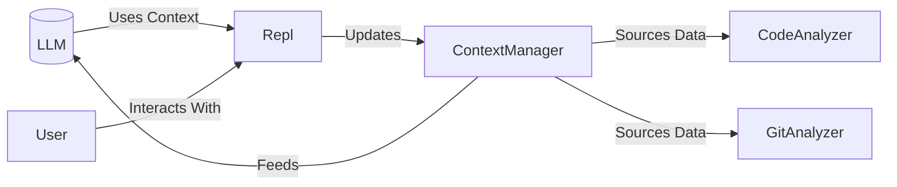

**Advanced Recommendations & Emerging Capabilities:**

---

### 1. **Semantic Code Search Engine**
**Leverage:** `VectorStore` + `CodeAnalyzer`
```ts
// Add to ContextManager
async semanticCodeSearch(query: string) {
  const results = await this.vectorStore.search(query);
  return this.graph.getConnectedEntities(results.map(r => r.id));
}
```
**Use Case:** "Find all functions handling payment validation" becomes vector similarity search across code embeddings rather than regex.

---

### 2. **Automated Documentation Generation**
**Leverage:** `codeMap.ts` + `ContextGraph`
**Implementation:**
```ts
// New DocGenerator service using existing analysis
generateModuleDocs(modulePath: string) {
  const structure = analyzeTypeScriptFile(modulePath);
  const entities = contextManager.query(`file:${modulePath}`);
  return renderMarkdown(structure, entities);
}
```
**Non-Obvious Benefit:** Auto-update docs when `ContextManager` detects code changes through git hooks.

---

### 3. **AI-Powered Code Validation**
**Leverage:** `Repl` + `codeMap.ts`
**Pattern:**
```ts
// In tool-repair logic
const expectedShape = codeMap.analyzeTypeScriptFile(targetFile);
const validationPrompt = `Validate response matches ${expectedShape.interfaces[0].name} schema`;
```
**Use Case:** Ensure AI-generated code matches existing interface contracts before committing.

---

### 4. **Architectural Hotspot Detection**
**Leverage:** `analyzer.ts` metrics + `ContextGraph`
**New Metric:**
```ts
calculateComplexityScore() {
  return this.codeMetrics.cyclomaticComplexity *
         this.contextGraph.getDependencyCount(id);
}
```
**Insight:** Surface files with high coupling + high complexity that need refactoring.

---

### 5. **Real-Time Context During Chat**
**Leverage:** `MessageHistory` + `ContextManager`
**Integration Point:**
```ts
// Modify Repl's message construction
messages: [
  ...contextManager.getRelevantEntitiesAsSystemPrompts(),
  ...messageHistory.get()
]
```
**Magic:** Every AI interaction automatically receives related code/git context.

---

### 6. **Security Auditor**
**Leverage:** `analyzer.ts` dependency analysis
**New Check:**
```ts
// Flag suspicious patterns
if (dependency.name.includes('crypto') && !whitelisted) {
  terminal.warn(`Potentially unsafe crypto usage in ${file}`);
}
```
**Pro Tip:** Cross-reference with CVE databases using the dependency graph.

---

### Architectural Recommendations:
1. **Plugin System**
   Make `ContextManager` extensible for custom analyzers:
   ```ts
   registerAnalyzer(plugin: {
     analyze: (content: string) => CodeEntity[],
     filePatterns: string[]
   })
   ```

2. **Incremental Analysis**
   Add file hash checking in `CodeAnalyzer` to skip unchanged files.

3. **Cross-Project Context**
   Use `VectorStore` embeddings to find similar patterns across different repos.

---

### Non-Obvious Use Cases:

1. **Onboarding Assistant**
   New devs query: "How does our auth system work?" → AI uses code context + git history to generate guided walkthrough.

2. **Automated RFC Drafting**
   When detecting major architectural changes via `GitAnalyzer`, auto-generate design doc skeletons.

3. **CI Policy Enforcement**
   Hook `ContextManager` into pre-commit checks to block PRs that violate relationship rules in the graph.

4. **Test Impact Analysis**
   Cross-reference `ContextGraph` relationships with test coverage to predict which tests need updating.

---

### Emerging Capability Stack Idea:



**Key Innovation:** The system becomes self-improving - AI interactions generate new context that improves future AI responses.

---

**Suggested Next Steps:**

1. Add context-aware error recovery in `Repl`:
```ts
try {
  // Current tool call
} catch (error) {
  const repairContext = await contextManager.query(error.message);
  retryPrompt = `Fix using ${repairContext[0].id}...`;
}
```

2. Implement hot-reloading for `ContextGraph` when files change.

3. Add similarity search cache to `VectorStore` using HNSW indexes.

**High-Value Quick Wins Recommendation:**

---

### 1. **Interactive Configuration Wizard**
**Why Valuable:** Directly addresses `partial_features.md` gap #1 and `todo.md` item #3
**Implementation:**
```ts
// Add to commands/manager.ts
commands.register({
  name: "init-config",
  description: "Create project configuration interactively",
  handler: async (terminal) => {
    const configPath = path.join(process.cwd(), ".acai/acai.json");
    const existing = await config.readProjectConfig().catch(() => ({}));

    const newConfig = await terminal.form([
      {
        type: "text",
        name: "build",
        message: "Build command:",
        initial: existing.build || "npm run build"
      },
      {
        type: "text",
        name: "test",
        message: "Test command:",
        initial: existing.test || "npm run test"
      }
    ]);

    await fs.mkdir(path.dirname(configPath), { recursive: true });
    await fs.writeFile(configPath, JSON.stringify(newConfig, null, 2));
    terminal.success(`Config created at ${configPath}`);
  }
});
```
**Leverages Existing:** `config.ts` + `CommandManager`
**Time Estimate:** 2-3 hours

---

### 2. **Auto-Contextual Error Recovery**
**Why Valuable:** Addresses `todo.md` item #1 and `partial_features.md` gap #8
**Implementation:**
```ts
// Modify Repl error handling
try {
  // existing code
} catch (error) {
  const errorContext = await contextManager.query(error.message);
  const similarSolutions = errorContext
    .filter(e => e.type === "commit")
    .map(c => c.metadata.subject);

  terminal.box("Similar Fixes", similarSolutions.join("\n"));
  promptManager.push(`Fix this error using: ${similarSolutions[0]}`);
}
```
**Leverages Existing:** `ContextManager` + `MessageHistory`
**Time Estimate:** 3-4 hours

---

### 3. **Change Impact Preview**
**Why Valuable:** Complements existing `FileManager` and `GitTools`
**Implementation:**
```ts
// Add to FileManager
showChangeImpact(edit) {
  const relatedFiles = this.contextManager.query(`file:${edit.filePath}`);
  const dependentEntities = relatedFiles
    .flatMap(e => e.relationships)
    .filter(r => r.type === "REFERENCES");

  terminal.box("Impact Preview", [
    `Will modify: ${edit.filePath}`,
    `Affects: ${dependentEntities.length} entities`,
    `Recent changes: ${getRecentCommits(edit.filePath)}`
  ].join("\n"));
}
```
**Leverages Existing:** `ContextGraph` relationships
**Time Estimate:** 2-3 hours

**Why These First?**
1. Directly completes existing partial features
2. Maximizes value of already-built context subsystem
3. Creates visible UX improvements with minimal new code
4. All use existing patterns in `CommandManager`/`Repl`
